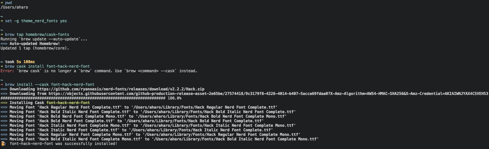

# Fish
### I will come back and refresh files... ik ik its messy

## Fish over zsh/bash


# hack fonts  -  (need_updating)

- 


---

# Plugins
#important/fish/plugins


## [awsn.fish](https://github.com/jorgebucaran/awsm.fish)


### just a list, I dont use most of them...


---
---
---


# Stackoverflow

## [Suppress or Customize Intro Message in Fish Shell](https://stackoverflow.com/questions/13995857/suppress-or-customize-intro-message-in-fish-shell)


>		Found that the greeting message is set in fishd.Machine.local.


 `~/.config/fish/config.fish`


``` fish
set fish_greeting
```


---


