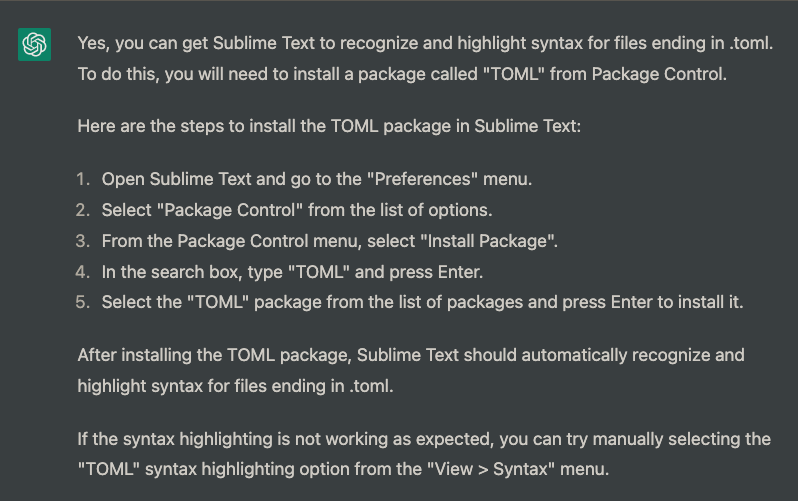
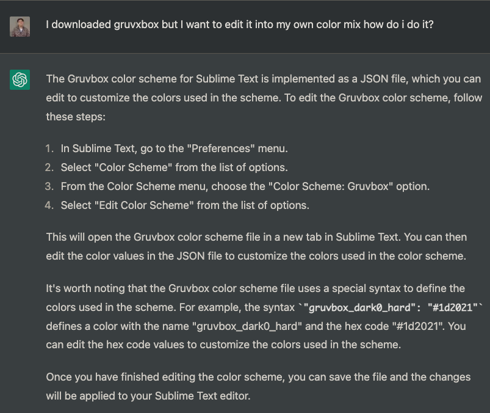
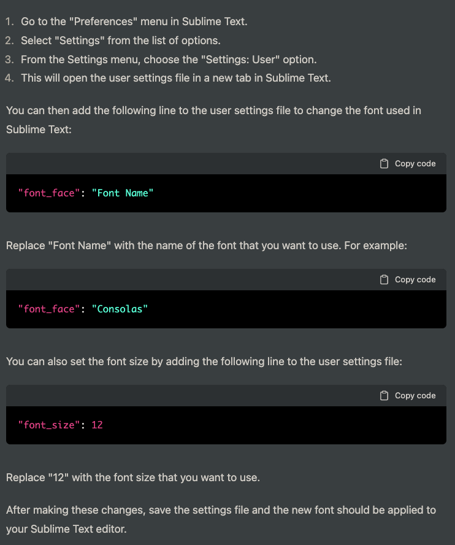
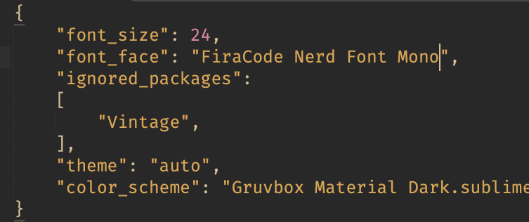

# I will come back and refresh files... ik ik its messy

#subl 

---
### hidden src  in 'dev'
(dev)[aharo24/dev]

## Packages
#subl/packages

- 

## colorschemes

- search colorschemes on the web first
	- 
	- 
- colorscheme.config
	- 

---
---

## helium

### **[Helium Doc](https://github.com/sschuhmann/Helium)**
#subl/helium

- advance af, I'll come back later

---
---

## fonts 

- steps to change font
	- 
	- 
	- 
- 
- my font settings
	- 
- 

