# Pandas

#  [Documentation](https://pandas.pydata.org/docs/)

- help(pd.[function])  #help_pd
	- gives you a man -help
		- ie... `help(pd.series)`
			- #long_af_issue_git
		- in depth --> [Attribute_vs_Function_Calls](arrays.md#Attribute_vs_Function_Calls)
	- 
	- 
	- 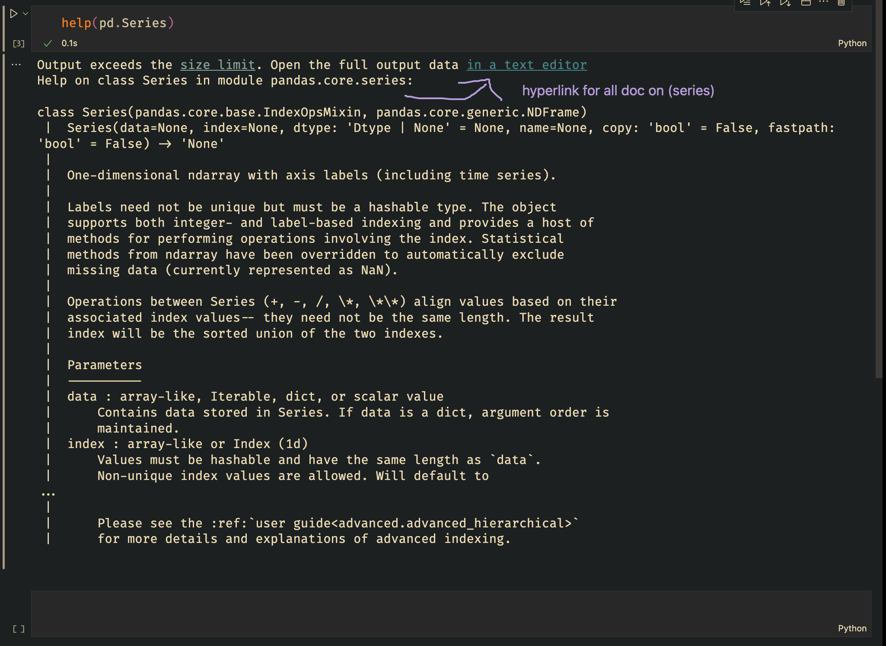
- #attribute_vs_func 

## Intro

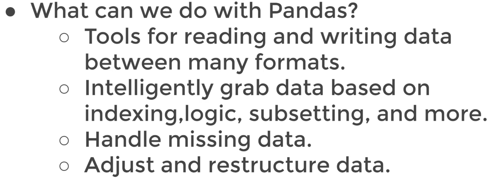
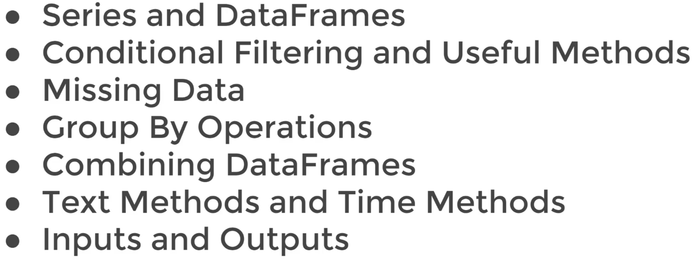

- like an excel but for pandas but more powerful
- ss

# Series 

# Series_part_one

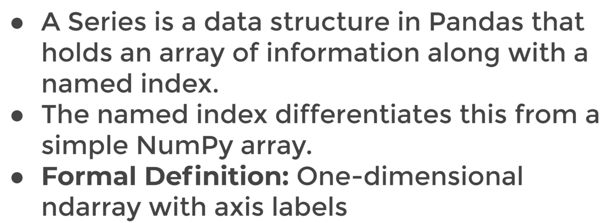

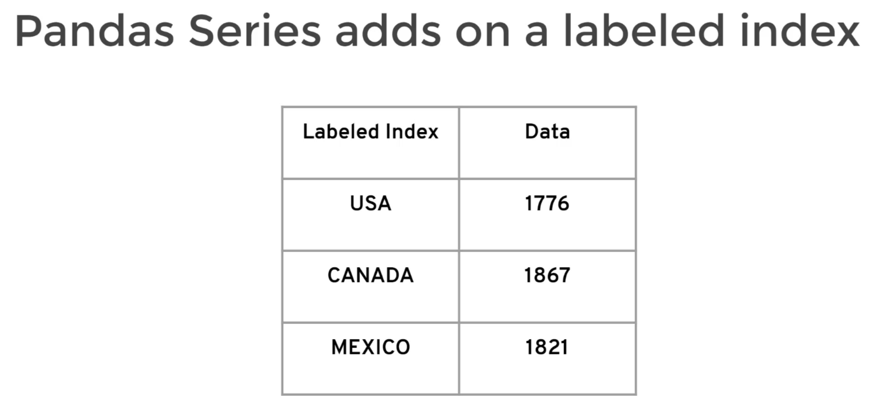

- Pandas seires replaces the [0,1,2,3] for names 
	- usa
	- canada
	- mexico

## series_data_index

`data`

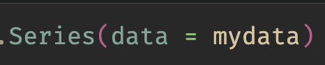

`index`

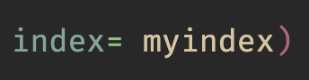

**Lets combined them** 
`myser = pd.Series(mydata,myindex)`

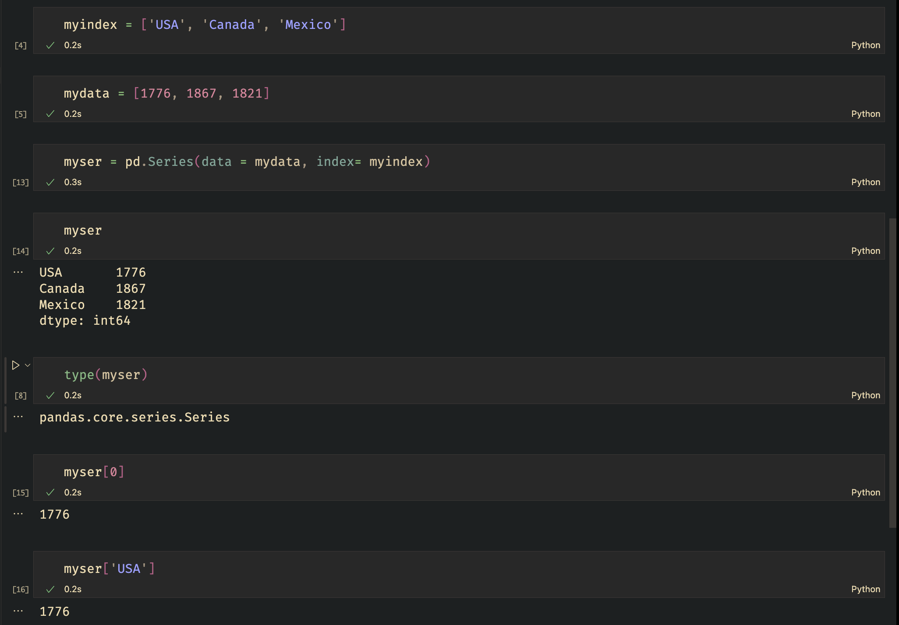

From the looks, most real life data we will be using comes form dict (hashmaps/dict)

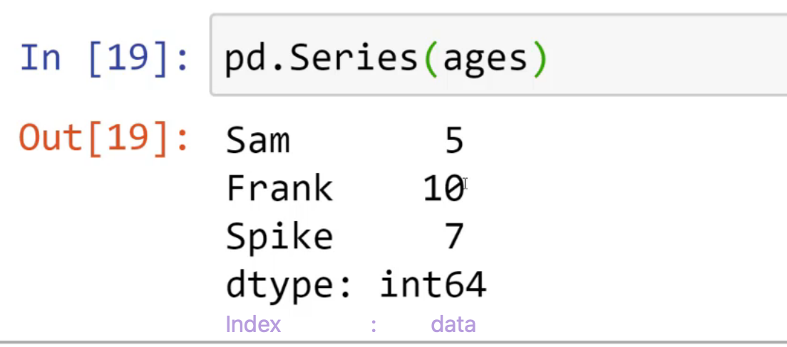

**Part One Finished**

---

# Series_part_two

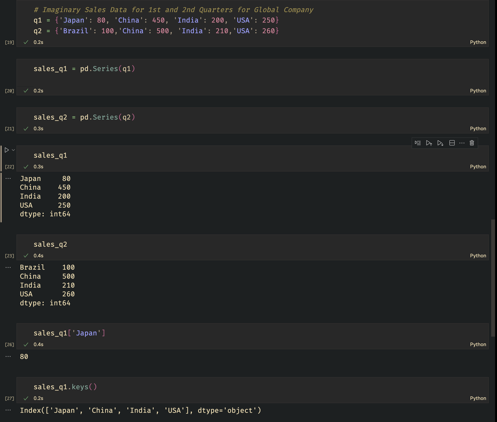

- `keys()`

**we can do this because of broadcast**
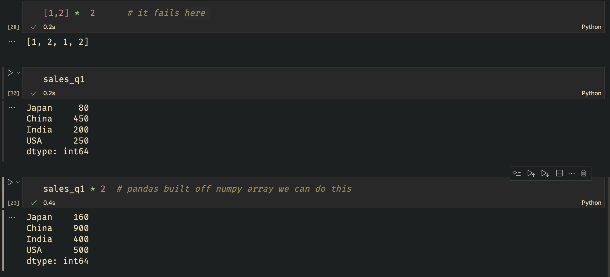

### NaN 
- the 2 datasets that you are ( + - / * ) do no cross over 
	- ie... look above
	- no_bueno: Brazil and Japan
	- cross_over: China, India, and USA

