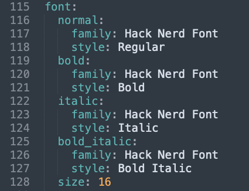

# Alacritty File
```sh
#  █████╗ ██╗      █████╗  ██████╗██████╗ ██╗████████╗████████╗██╗   ██╗
# ██╔══██╗██║     ██╔══██╗██╔════╝██╔══██╗██║╚══██╔══╝╚══██╔══╝╚██╗ ██╔╝
# ███████║██║     ███████║██║     ██████╔╝██║   ██║      ██║    ╚████╔╝
# ██╔══██║██║     ██╔══██║██║     ██╔══██╗██║   ██║      ██║     ╚██╔╝
# ██║  ██║███████╗██║  ██║╚██████╗██║  ██║██║   ██║      ██║      ██║
# ╚═╝  ╚═╝╚══════╝╚═╝  ╚═╝ ╚═════╝╚═╝  ╚═╝╚═╝   ╚═╝      ╚═╝      ╚═╝
# A cross-platform, OpenGL terminal emulator.
# https://alacritty.org

live_config_reload: true

env:
  TERM: xterm-256color

window:
  decorations: buttonless
  dynamic_padding: false
  opacity: 0.8
  padding:
    x: 25
    y: 20

font:
  normal:
    family: "SFMono Nerd Font"
    style: Medium
  italic:
    family: "SFMono Nerd Font"
    style: Medium Italic
  bold:
    family: "SFMono Nerd Font"
    style: Heavy
  bold_italic:
    family: "SFMono Nerd Font"
    style: Heavy Italic
  size: 15

# NOTE: helpful hex codes
# \x1b = escape (useful for vim-related keybindings)
# \x02 = control-b (the default tmux prefix)

key_bindings:
################################################ TMUX STUFF ################################################
#  - { key: Minus, mods: Command|Shift, chars: "\x02\"" } # split tmux window vertically
#  - { key: VerticalBar, mods: Command|Shift, chars: "\x02%" } # split tmux window horizontally
  - { key: T, mods: Command, chars: "\x02c" } # create a new tmux window
  - { key: W, mods: Command, chars: "\x02x" } # kill the current pane
  - { key: Tab, mods: Control, chars: "\x02n" } # switch to next tmux window
  - { key: LBracket, mods: Command, chars: "\x02p" } # switch to next tmux window
  - { key: RBracket, mods: Command, chars: "\x02n" } # switch to previous tmux window
  
  - { key: G, mods: Command, chars: "lazygit\n" } # open git manager 'jesseduffield/lazygit'
  - { key: Z, mods: Command, chars: "\x02" } # use Cmd + Z instead of default prefix
  - { key: L, mods: Command|Shift, chars: "lf\n" } # open file manager 'gokcehan/lf'


  - { key: Key1, mods: Command, chars: "\x021" } # select tmux window 1
  - { key: Key2, mods: Command, chars: "\x022" } #                ... 2
  - { key: Key3, mods: Command, chars: "\x023" } #                ... 3
  - { key: Key4, mods: Command, chars: "\x024" } #                ... 4
  - { key: Key5, mods: Command, chars: "\x025" } #                ... 5
  - { key: Key6, mods: Command, chars: "\x026" } #                ... 6
  - { key: Key7, mods: Command, chars: "\x027" } #                ... 7
  - { key: Key8, mods: Command, chars: "\x028" } #                ... 8
  - { key: Key9, mods: Command, chars: "\x029" } #                ... 9
#############################################################################################################

import:
  # - ~/.config/alacritty/themes/catppuccin/themescatppuccin-mocha.yml
   - ~/.config/alacritty/themes/catppuccin/catppuccin-macchiato.yml
  # - ~/.config/alacritty/themes/catppuccin/catppuccin-frappe.yml
  # - ~/.config/alacritty/themes/catppuccin/catppuccin-latte.yml
#
# import:
#   - ~/.config/alacritty/aw/current.yml
```


# Updating Fonts
## Hacked Fonts
- match the name of the default Font name given by OS not by your preferred name
	- 
	-  correct:
		- 
	- wrong:
		- 
- 
- 
- correct:
- 


## decapricated 

### mouse_clicks

> 	[0.000484510s] [WARN ] [alacritty_config_derive] Config warning: url has been deprecated; use `hints` section instead

- fix
	- 
	- 
	- 


## troubleshoot

### how to troubleshoot

whenever you get error just do `alacritty` and a new check the logs of the new window

- error
	- 
	- 


## Line Indicator


``` yml
  # Line indicator
  #
  # Color used for the indicator displaying the position in history during
  # search and vi mode.
  #
  # By default, these will use the opposing primary color.
  #line_indicator:
  #  foreground: None
  #  background: None


```

- ie...
	- 
	- 


## import

``` yml
import:
  - ~/.config/alacritty/themes/gruvbox-material-alacritty.yml
```


