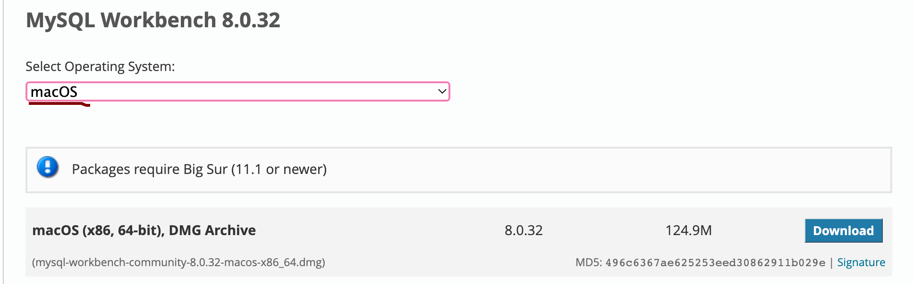
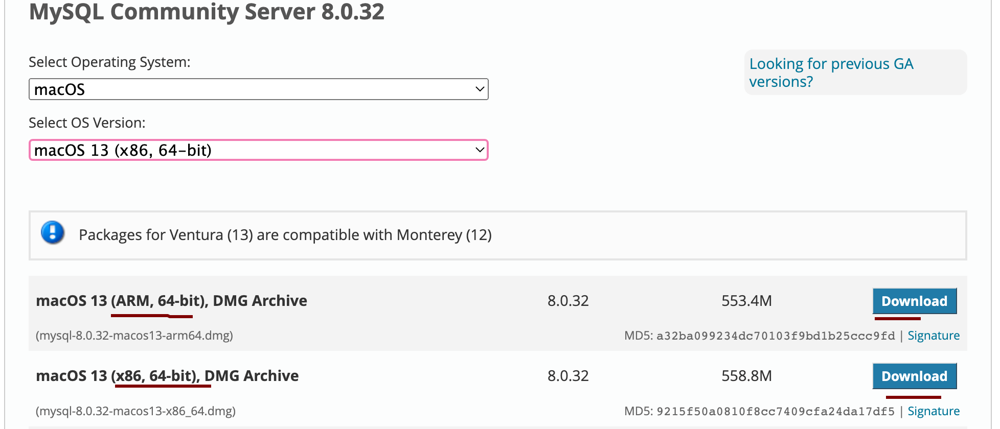

# Mac / Linux

## Steps

>	step one: 
>	... choose (os) for workbench

>
>	step two:
>	... choose arm or intel (mac)
>	... choose distro (linux)

## workbench
... choose operating system

#### [workbench](https://dev.mysql.com/downloads/workbench/)

## mysql server
... choose arm or intel (mac)
... choose distro (linux)

#### [mysql community server](https://dev.mysql.com/downloads/mysql/)

