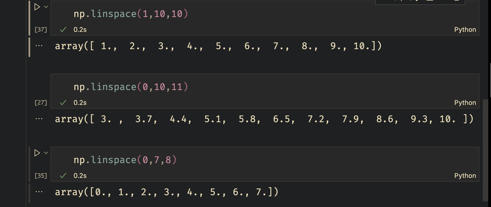
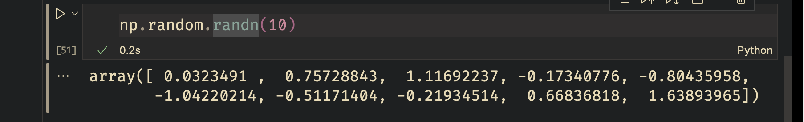
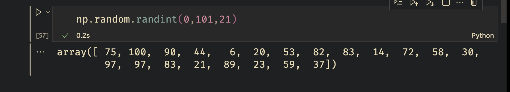
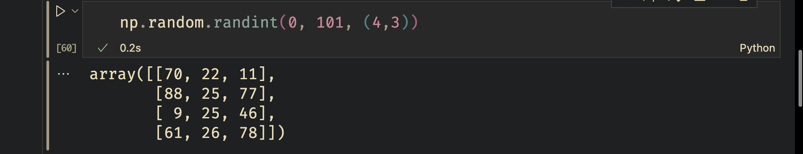
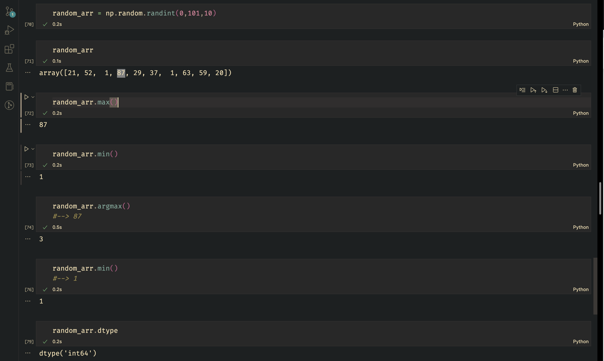

- [ ] # I will come back and refresh files... ik ik its messy
## I was not even a week into .md note-taking here


# Range

* `range()`

````python
np.arange(0,7)
````

out: array(\[0, 1, 2, 3, 4, 5, 6\])

---

# Zeros

* `zeros()`

````python
np.zeros( (2,5) )
````


* np.zeros((**x**,**y**))
  * '**x**' --> rows
  * '**y**' --> columns 

---

# Ones

`np.ones()`

\>	same as np.zeros, now we spawn 1's.

---

### Linspace

`np.linspace()`
[linspace official source](https://numpy.org/doc/stable/reference/generated/numpy.linspace.html#:~:text=numpy.arange-,numpy.linspace,-numpy.logspace)

* 
* 



np.linespace(**start**, **stop**, **x**)

* start
  * where to begin
* stop
  * where to end
* x
  * **important** this number must math the start,stop *else* ~~its not human readable~~
    * `np.linspace(0,12,5)` --> #linspace_issue-00 

**Explanation**  #linspace_issue-00 

 > 
 > np.linspace(0,12,5)
 > output: array(\[ 0., 3., 6., 9., 12.\])

machine:				 0, 1, 2, 3, 4 *\<-->* 5 Human counts
human:                  1, 2, 3, 4, 5
output:				\[0, 1, 2, 3\] |


---
`Update Jan 25,2023`
the 100 is the give me this many dots in between 0~500
```python
potential_spend= np.linspace(0,500,100)
```

---

# Identity Matrix

`np.eye()`


---

# Random

`np.random()`
np.random.**[distributions()](https://numpy.org/doc/1.16/reference/routines.random.html#:~:text=a%20permuted%20range.-,Distributions,-%C2%B6)**

* All numpy random distributions can be found [here](https://numpy.org/doc/1.16/reference/routines.random.html#:~:text=a%20permuted%20range.-,Distributions,-%C2%B6)

`np.random.rand()`

 > 
 > Random values in a given shape.
 > Create an array of the given shape and populate it with random samples from a uniform distribution over `[0, 1)`.


`np.random.randn()`


`np.random.randint()`




`np.random.seed()`

* *func* seed resource: [here](https://numpy.org/doc/1.16/reference/generated/numpy.random.seed.html#numpy.random.seed)

`reshape()`


`np.random.randint` more stuff



---

# Attribute_vs_Function_Calls
#attribute_vs_func


* Atrribute
  * correct: random_arr.dtype
  * correct: random_arr.shape
    * wrong: random_arr.dtype\*\*~~()~~\*\*
    * wrong: ~~random_arr.shape()~~


* Func call ()
  * whenever we call "**()**"

---
