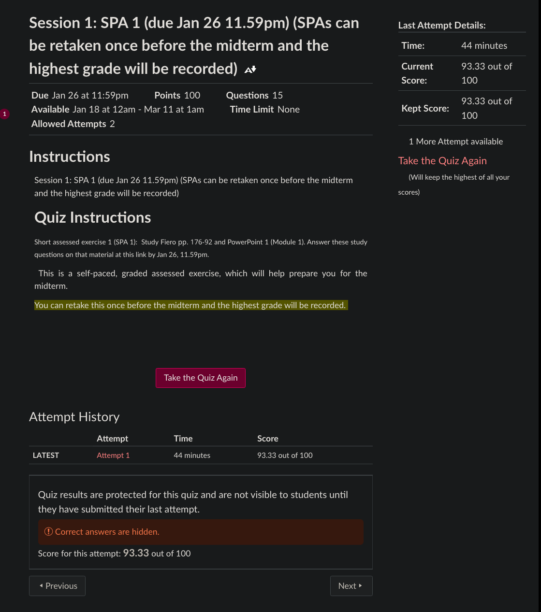

### Jan 26, 2023 Assignments 
Take off is SPA 1 & intro email due Jan 26, 11.59pm. 

- [x] SPAs are a little touch your toes for your neurons.
- [x] intro email
- [ ] reply to [db]

[ch.17](https://archive.org/details/prince_librivox/prince_07_machiavelli.mp3)
for intro [db]


# Module One
quiz-1
## pg.177
### Rebirth: THE AGE OF THE RENAISSANCE

The Renaissance—meaning “rebirth”—was the turning point between medieval and modern times. It marks the revival of Greco-Roman culture, a movement that spread from its birthplace in Flor-ence, Italy, to all parts of the European West. More generally, it describes the broader intellectual renewal that produced a wealth of new technology and ideas, from the printing press to the for-mulation of linear perspective and other techniques for achieving pictorial naturalism, and from mapmaking to ingenious systems of record-keeping. The Age of the Renaissance, the period from roughly 1300 to 1600, witnessed a spirit of self-conscious individualism in political and economic life, as well as in the arts. Money, fame, and power were the motivating forces of the men and women who, like their modern-day counterparts, easily reconciled their worldly pursuits with their religious beliefs. The Age of the Renaissance opened with a century of European warfare and devastating plague. Nevertheless, the fifteenth and sixteenth centuries saw the growth of the European nation-states, the rise of a prosperous middle class, and the advancement of Classically based education, as well as the celebrated revival of Greco-Roman principles in art and architecture. An optimistic view of the human potential for knowledge and pleasure inspired this European rebirth that left the world many of its most glorious landmarks.

**A First Look:** 
	The mysterious smile of the woman in this sixteenth-century portrait (Figure 7.1) by Leonardo da Vinci (1453–1519) has intrigued viewers for centuries. Identified by modern schol-ars as the wife of the wealthy Florentine merchant Francesco del Gioconda and called “La Gioconda,” she is better known as Mona Lisa (see page 202). The most famous female image in the history of Western art, she has been idealized in love songs, implicated in modern mystery capers, and subjected to thousands of commercial abuses. She was even given a mustache by the twentieth-century Dada artist Marcel Du-champ (see Figure 14.27). For centuries, admirers have tried to interpret the meaning of Mona Lisa’s enigmatic smile. But she is a landmark figure for other reasons, as well: She was among the first to be portrayed in a landscape setting, rather than in the traditional domestic interior. Her lifelike pres-ence is achieved by means of the techniques of aerial per-spective and sfumato, the subtle blurring of contours for which Leonardo, who is said to have worked on the portrait for three years, was famous. The prime example of the rebirth of naturalistic portraiture in the West, the Mona Lisa has be-come symbolic of the individualism and humanism that marked the Age of the Renaissance.


## pg.178
### TRANSITION: MEDIEVAL TO RENAISSANCE

The fourteenth century was a period of transition marked by a number of dramatic developments: the struggle for survival against the devastating bubonic plague, the trials of a long and debilitating war between England and France, and the decline of the Roman Catholic Church. These phenomena—the Black Death, the Hundred Years War, and the Great Schism—radically altered all aspects of Western European life and culture. In the arts of this era, there are clear signs of a revived self-consciousness, a growing preoccupation with gender and class, and spirited efforts to represent the world with greater objectivity. 

### The Black Death
The most devastating natural catastrophe of the fourteenth cen-tury, the bubonic plague, struck Europe in 1347. In less than a century it destroyed one-third to one-half of its population. Origi-nating in China and spread by the Mongol tribes that dominated that vast area, the disease devastated East Asia and the Middle East, interrupting long-distance trade and cross-cultural encoun-ters that had flourished for two centuries. The plague was carried into Europe by flea-bearing black rats infesting the commercial vessels that brought goods to Mediterranean ports. In its early stages, it was transmitted by the bite of either the infected flea or the host rat; in its more severe pneumonic stage, it was passed on by those infected with the disease. The symptoms of the malady were terrifying: Buboes (or abscesses) that began in the lymph glands of the groin or armpits of the afflicted slowly filled with pus, turning the body a deathly black, hence the popular label “the Black Death.” Once the boils and accompanying fever ap-peared, death usually followed within two to three days. Tradi-tional treatments, such as the bleeding of victims and fumigation with vapors of vinegar, proved useless. No connection was per-ceived between the rats and the plague itself, and in the absence of a clinical understanding of bacterial infection, the medical pro-fession of the day was helpless. (Indeed, the bacillus of the bu-bonic plague was not isolated until 1894.) The plague hit hardest in the towns, where the concentration of population and the lack of sanitation made the disease more difficult to contain. Four waves of bubonic plague spread throughout Europe between 1347 and 1375, infecting some Euro-pean cities several times and nearly wiping out their entire popu-lations (Figure 7.2). If the psychological impact of the Black Death was traumatic, its economic eff ects were equally devastat-ing. Widespread death among the poor caused a shortage of labor, which in turn created a greater demand for workers. The bargaining power of those who survived the plague was thus improved. In many parts of Europe, workers pressed to raise

## pg.179
their status and income. Peasants took advantage of opportuni-ties to become tenant farmers on lands leased by lords in need of laborers. Others fled their rural manors for cities, where jobs were readily available. This exodus from the countryside spurred urban growth and contributed to the slow disintegration of ma-norialism, the economic system that bound medieval serfs to the land (see page 135). All of Europe, however, was disadvantaged by climatic disas-ters that caused frequent crop failure and famine, and by the continuing demands of financially threatened feudal overlords. Violent working-class revolts—the first examples of labor rebel-lion in Western history—broke out in France and England in the mid-fourteenth century. In 1358, French peasants (known as jacques) staged an angry protest (the Jacquerie) that took the lives of hundreds of noblemen before it was suppressed by the French king. In England, the desperation of the poor was mani-fested in the Peasants’ Revolt of 1381, led by Wat Tyler and de-scribed in the Chronicles of the French historian Jean Froissart (1338–1410). Despite their ultimate failure, these revolts left their imprint on the social history of the West. They frightened landowners everywhere and lent an instability to class relation-ships that hastened the demise of the old feudal order.

### The Rise of Constitutional Monarchy 
While the peasant rebellions achieved no immediate reforms, the lower classes had taken a major step toward equality with the rest of society. England’s laborers were not the first, however, to have contested the absolute authority of the English monarch. As early as 1215, the barons of the realm had forced King John of England (1167–1216) to sign the landmark document called Magna Carta (Latin, “great charter”), which forbade the king to levy additional feudal taxes without the consent of his royal coun-cil. Magna Carta, which was also interpreted as guaranteeing such other freedoms as trial by jury, is regarded as a landmark because it asserted the primacy of law over the will of the ruler—a principle that paved the way for the development of constitu-tional monarchy. Only fifty years after the signing of Magna Carta, the English
nobility, demanding equal authority in ruling England, impris-oned King Henry III (1207–1272) and invited middle-class rep-resentatives to participate in the actions of the Great Council (Parliament), thus initiating the first example of representative government among the burgeoning nation-states of the West. During the fourteenth century, as Parliament met frequently to raise taxes for England’s wars with France, it bargained for greater power, including the right to initiate legislation. Peasants and laborers still exercised no real political influence, but by the end of the century the English had laid the groundwork for a constitutional monarchy that would bridge the gap between medieval feudalism and modern democracy.

### The Hundred Years War 
In France, the ills of plague, famine, and civil disturbance were compounded by a war with England that lasted more than one
hundred years (1337–1453) and was fought entirely on French soil. Larger and more protracted than any previous medieval conflict, the Hundred Years War was the result of a longstand-ing English claim to continental lands: From the time of the Norman Conquest, the kings of England had held land in France, a situation that caused chronic resentment among the French. But the immediate cause of the war was the English claim to the French throne, occasioned by the death of Charles IV (1294–1328), the last of the male heirs in a long line of French kings that had begun with Hugh Capet in 987 C.E. The war that began in 1337 was marked by intermittent bat-tles, in many of which the French outnumbered the English by three or four to one. Nevertheless, the English won most of the early battles of the war, owing to their use of three new “secret” weapons: the foot soldier, the longbow, and gunpowder—the invisible enemy that would ultimately eliminate the personal element in military combat. Along with the traditional cavalry, the English army depended heavily on foot soldiers armed with longbows. The thin, steel-tipped arrows of the 6-foot longbow could be fired more quickly and at a longer range than those of the traditional crossbow. Because the thin arrows of the longbow easily pierced the finest French chain mail, plate mail soon came to replace chain mail. However, within the next few centuries, even plate mail became obsolete, since it proved useless against artillery that employed gunpowder. Introduced into Europe by the Muslims, who acquired it from the Chinese, gunpowder was first used in Western combat during the Hundred Years War. In the first battle of the war, however, the incendiary substance proved too potent for the poorly cast English cannons, which issued little more than terrifying noise. Still, gunpowder, which could lay waste an entire city, constituted a landmark advance in military technology. Although the English repeatedly devastated the French armies throughout the Hundred Years War, the financial and physical burdens of garrisoning French lands ultimately proved too great for the English. Facing a revitalized French army under the charismatic leadership of Joan of Arc, the English finally withdrew from France in 1450. Of peasant background, the seventeen-year-old Joan begged the French king to allow her to obey the voices of the Christian saints who had directed her to expel the English. Donning armor and riding a white horse, she led the French into battle (Figure 7.3). Her success forced the English to withdraw from Orléans but initiated her martyrdom. Betrayed by her supporters, in 1431 she was condemned as a heretic and burned at the stake. The Hundred Years War dealt a major blow to feudalism. By the mid-fifteenth century, the French nobility was badly depleted. Hand-to-hand combat and the “rules” of medieval chivalry were outmoded by the dramatically impersonal technology of gun-powder. In France, feudal allegiances were soon replaced by a system of national conscription. In the decades following England’s withdrawal from France, both countries began to move in separate directions, ultimately becoming independent nation states.


## pg.180
### The Decline of the Church 
The growth of the European nation-states contributed to the weakening of the Christian commonwealth, especially where Church and state com-peted for influence and au-thority. The two events that proved most damaging to the prestige of the Catholic Church were the Avignon Pa-pacy (1309–1377) and the Great Schism (1378–1417). The term “Avignon Papacy” describes the relocation of the papacy from Rome to the city of Avignon in southern France (see Map 6.1) in response to political pressure from the French king Philip IV (“the Fair”; 1268–1314). Attempting to compete in prestige and po-litical influence with the secu-lar rulers of Europe, the Avignon popes established a luxurious and powerful court using stringent (and occasionally corrupt) means to accomplish their purpose. The increasing need for Church revenue led some of the Avignon popes to sell Church offices (a practice known as simony), to levy additional taxes upon the clergy, to elect mem-bers of their own families to ecclesiastical office, and to step up the sale of indulgences (pardons from temporal penalties for sins committed by lay Christians). From the twelfth century on, the Church had sold these certificates of grace—drawn from the “sur-plus” of good works left by the saints—to lay Christians who bought them in order to speed their own progress to heaven or to benefit their relatives and friends in Purgatory. While the seven popes who ruled consecutively from Avignon were able adminis-trators, their unsavory efforts at financial and political aggran-dizement damaged the reputation of the Church. The return of the papacy to Rome in 1377 was followed by one of the most devastating events in Church history, the Great Schism: A rift between French and Italian factions of the College of Cardinals led to the election of two popes, one who ruled from Avignon, the other who ruled from Rome. For more than thirty years, there were two conflicting claims to universal sovereignty and bitter controversy within the Church. As each pope excom-municated the other, laypeople questioned whether any Chris-tian soul might enter heaven. The Great Schism proved even more detrimental to Church prestige than the Avignon Papacy, for while the latter had prompted strong anticlerical feelings—even shock—in Christians who regarded Rome as the traditional home of the papacy, the Schism violated the very sanctity of the Holy Office.


## pg.181
## THE ARTS IN TRANSITION
Fourteenth-century Europeans manifested an unprecedented preoccupation with differences in class, gender, and personality. Both in literature and in art, there emerged a new fidelity to nature and to personal experience in the everyday world. This close, objective attention to human society and social interaction may be described as “social realism.” This new realism is apparent in the popular woodcuts of the Dance of Death (see Figure 7.2), where class differences are clearly drawn. It is also evident in the landmark vernacular works of three notable fourteenth-century writers: Giovanni Boccaccio, Christine de Pisan, and Geoffrey Chaucer. 

### Boccaccio 
The virulence of the plague and the mood of mounting despair horrified the Florentine poet and humanist Giovanni Boccaccio (1313–1375). A prolific writer of Italian prose romances and lyric poetry, Boccaccio was also the first biographer of Dante and the author of many Latin treatises and textbooks. But his landmark work is the celebrated collection of short stories known as the Decameron (1351). The framework for the Decameron is provided by the plague itself: Eager to escape contagion, seven young women and three young men retreat to a villa in the suburbs of Florence, where, to pass the time, each tells a story on each of ten days. The stories, designed as distractions from the horrors of the pandemic, are, in effect, amusing secular entertainments. They provide insight, however, into the social concerns and values of both their fictional narrators and Boccaccio’s reading public. Boccaccio borrowed many stories in the Decameron from popular fables, fabliaux (humorous narrative tales), and contemporary incidents. His characters resemble neither the allegorical figures of Everyman nor the courtly stereotypes of Lancelot. Rather, they are realistically conceived, high-spirited individuals who prize cleverness, good humor, and the world of the flesh over the classic medieval virtues of chivalry, piety, and humility. The Decameron must have had special appeal for men and women who saw themselves as the heroes of unstable and rapidly changing times. Toward the end of his life, Boccaccio repented writing what he himself called his “immoral tales”; nevertheless, his stories remain a lasting tribute to the varieties of human affection and desire. 

### Christine de Pisan 
The world’s first feminist writer, Christine de Pisan (1364–1428?), emerged in France. The daughter of an Italian physician, Chris-tine wed a French nobleman when she was fifteen—medieval women usually married in their mid-to late teens. Ten years later, when her husband died, Christine was left to support three chil-dren, a task she met by becoming the first female professional writer. Christine attacked the long antifemale tradition that had demeaned women and denied them the right to a university edu-cation. Her feminism is all the more significant because it oc-curred at a time in which men were making systematic efforts to restrict female inheritance of land and female membership in the guilds. In an early poem, the “Epistle to the God of Love” (1399), she protested the persistent antifemale bias of clerics and scholars with 
.
.
.
these words:
	Some say that many women are deceitful, Wily, false, of little worth: Others that too many are liars, Fickle, flighty, and inconstant; Still others accuse them of great vices, Blaming them much, excusing them nothing, Thus do clerics, night and day, First in French verse, then in Latin, Based on who knows what books That tell more lies than drunkards do. 
	
Christine was keenly aware of the fact that Western literary tradition did not off er a representative picture of women’s impor-tance to society. Eager to correct this inequity, she became a spokesperson for female achievements and talents. Inspired by Boccaccio’s On Famous Women (1374), a collection of 106 biographies of historical and mythological women, Christine wrote the allegorical Book of the City of Ladies (1405), an attack on male misogyny and a sound defense of the female’s right to education.

### Chaucer 
Geoffrey Chaucer (1340–1400), a contemporary of Boccaccio and Christine de Pisan, was one of the greatest masters of fourteenth-century vernacular literature. Writing in the everyday language of his time (Middle English), Chaucer shaped the development of English literature much as Dante, a century earlier, had influenced the course of Italian poetry. A middle-class civil servant, a soldier in the Hundred Years War, a diplomat, and a citizen of the bustling city of London, Chaucer left an indelible image of his time in a group of stories known as the Canterbury Tales (ca. 1390). Modeled broadly on Boccaccio’s Decameron, this versified human comedy was framed by Chaucer in the setting of a pilgrimage whose partici-pants tell stories to entertain one another while traveling to the shrine of Saint Thomas à Becket in Canterbury. Chaucer’s twenty-nine pilgrims, who include a miller, a monk, a plowman, a knight, a priest, a scholar, and a prioress, provide a literary cross section of late medieval society. Although they are type characters, they are also individual personalities. (The Pardoner, for instance, is portrayed as eff eminate, while the Wife of Bath is lusty.) Chaucer characterizes each pilgrim by descriptive detail, by their lively and humorous conversations, and by the twenty


## pg.182
THE NEW REALISM IN LITERATURE AND ART Chaucer: 
	The Wife of Bath “There was a good Wife from near Bath, but she was somewhat deaf, which was a shame. She had such skill in clothmaking that she surpassed the weavers of Ypres and Ghent. In all her parish there was no woman who could go before her to the offertory; and if someone did, the Wife of Bath was certainly so angry that she lost all charitable feeling. Her kerchiefs were of fine texture; those she wore upon her head on Sunday weighed, I swear, ten pounds. Her fine scarlet hose were carefully tied, and her shoes were uncracked and new. Her face was bold and fair and red. All of her life she had been an estimable woman: she had had five husbands, not to mention other company in her youth—but of that we need not speak now****. And three times she had been to Jerusalem; she had crossed many a foreign river; she had been to Rome, to Bologna, to St. James’ shrine in Galicia, and to Cologne. About journeying through the country she knew a great deal. To tell the truth she was gap-toothed. She sat her gentle horse easily, and wore a fine headdress with a hat as broad as a buckler or a shield, a riding skirt about her large hips, and a pair of sharp spurs on her heels. She knew how to laugh and joke in company, and all the remedies of love, for her skill was great in that old game.” This excerpt from the Preface to the Canterbury Tales illustrates Chaucer’s use of descriptive detail to bring zesty realism to his characters. The Wife of Bath, one of the liveliest of his twenty-nine pilgrims, comes to life by way of his pen. Similarly, the artists Jean, Pol, and Herman Limbourg—who illustrated the prayer book known as the Très Riches Heures (Very Precious Hours) for Jean, duke of Berry and brother of the French king—introduced a new level of descriptive detail to the art of manuscript illumination. At the turn of the fifteenth century, the Limbourgs explored the mundane activities and labors peculiar to each month of the year. For the month of February, they produced the first snowscape in Western art. Three peasants warm themselves by a fire, while others hurry to complete their chores (Figure 7.4). The Limbourg brothers show a fascination with visual details: Dovecote and beehives are topped with new-fallen snow, smoke curls from a chimney, and three laborers lift their robes immodestly before the fire.
	
	Q Which of Chaucer’s descriptive details work to create a realistic portrait? Which visual details in the Limbourg miniature work to create a realistic scene?


## pg. 184
### [Chaucer-pg181](hum-204.md#Chaucer)
stories they tell, which range from moral tales and beast fables to fabliaux of the most risqué and bawdy sort. Like his medieval predecessors, Chaucer tended to moralize,
reserving special scorn for clerical abuse and human hypocrisy. But unlike his forebears, whose generalized view of human na-ture often produced stereotypes, Chaucer brought his characters to life by means of memorable details.
### Giotto’s New Realism 
The pioneer in painting on the eve of the Renaissance was the Florentine artist Giotto (1266–1337). Giotto’s art represents a landmark in a new era because it introduced a natural and lifelike style that anticipated Italian Renaissance picture-making. Giotto broke with the decorative formality of Byzantine painting (see Figure 4.18), which had strongly influenced the style of the late medieval altarpiece (see Figure 6.26). In place of the flat, stylized saints of the Byzantine icon, he introduced weighty, robust figures that are solemnly posed and set in shallow but convincing space. Modeling form through gradations of light and shade (a tech-nique known as chiaroscuro), he gave his figures a three-dimen-sional presence not seen since Roman times. Giotto brought this new realism to his panel paintings, and most notably to the fa-mous cycle of frescoes he executed for the family chapel of the wealthy Enrico Scrovegni in Padua (Figure 7.5). On the walls of the chapel, Giotto illustrated familiar episodes from the lives of the Virgin and Jesus. While wholly traditional in subject matter, in style Giotto took a new direction, giving weight and volume to figures whose nobility and dignity call to mind Clas-sical sculpture. In the Lamentation over Jesus (Figure 7.6), where the mourners are theatrically set in shallow but carefully defined space, Giotto subtly varied the gestures and degrees of sorrow, ranging from the stoic despair of the Virgin Mother to the grief-stricken anguish of the angels that flutter above the scene. Like the characters in Boccaccio’s Decameron and Chaucer’s Canterbury Tales, Giotto’s figures are convincingly human: While not individu-alized to the point of portraiture, neither are they stereotypes. They anticipate the direction of art in the age of rebirth. 

### The Ars Nova in Music 
Imagination and diversity characterized fourteenth-century mu-sic, which composers of that era self-consciously labeled the ars nova (“new art”). The music of the ars nova featured increased rhythmic complexity and aural expressiveness, achieved in part by isorhythm (literally, “same rhythm”): the close repetition of identical rhythmic patterns in different portions of a composi-tion. Isorhythm, which reflected a new interest in the manipula-tion of pitches and rhythms, gave unprecedented unity to musical compositions. At the same time, unexpected variations in rhyth


## pg.185
mic patterns might be achieved by way of a new musical effect known as syncopation, which shifted the accent from the nor-mally strong beat to the weaker beat. In France, the leading proponent of the ars nova was the French poet, priest, and composer Guillaume de Machaut (1300–1377). In his day, Machaut was more widely known and acclaimed than Chaucer or Boccaccio. Machaut held commis-sions from such members of the French aristocracy as the duke of Berry, patron of the Limbourg brothers (see Figure 7.4). Machaut wrote hundreds of poems, including a verse drama interspersed with songs. His most important musical achieve-ment, however, was his Messe de Notre Dame (Mass ofOur Lady; ca. 1350). Departing from the medieval tradition of treating the Mass as five separate compositions (based on Gregorian chant), he unified the textually fixed portions of the Mass into a single polyphonic composition, and added a sixth movement, the “Itemissa est” (“Go, the Mass is ended”) that dismissed the congre-gation. Machaut’s eff ort at coherence of design is clear evidence that composers had begun to rank musical eff ect as equal to liturgical function. This landmark treatment of the Catholic liturgy set a precedent for such composers as the sixteenth-century Palestrina and the Baroque master Johann Sebastian Bach (see pages 291–292). Machaut’s sacred compositions represent only a small part of
his total musical output. His numerous secular works include 142 polyphonic ballades (secular songs); these look back to the music of the trouvères (see page 139), but their attention to expressive detail is unique. They introduce new warmth and lyricism, as well as vivid poetic imagery—features that parallel the humanizing currents in fourteenth-century art and literature. “One who does not compose according to feelings,” wrote Mach-aut, “falsifies his work and his song.”

### THE ITALIAN RENAISSANCE
The new realism in the arts, increasing secularism, and the spirit of criticism that accompanied the decline of the Church—all features of the transitional fourteenth century—came into focus in the cities of the Italian peninsula. Italy was the homeland of Roman antiquity, the splendid ruins of which stood as remind-ers of the greatness of Classical civilization. The least feudalized part of the medieval world and Europe’s foremost commercial and financial center, Italy had traded with Southwest Asian cit-ies even in the decades that followed the fall of Rome. It had also maintained cultural contacts with Byzantium, the heir to Greek culture. The cities of Italy, especially Venice and Genoa (Map 7.1), had profited financially from the Crusades and—despite the ravages of the plague—continued to enjoy a high level of commercial prosperity. But it was in Florence, dominated by its landmark cathedral, that the Renaissance would come to flower (Figure 7.7). In fourteenth-century Florence, shopkeep-ers devised a practical system (based on Arab models) of track-ing debits and credits: Double-entry bookkeeping helped merchants to maintain systematic records of transactions in what was the soundest currency in the West, the Florentine gold florin. Fifteenth-century handbooks on arithmetic, foreign cur-rency, and even good penmanship encouraged the commercial activities of traders and bankers. The pursuit of money and leisure, rather than a preoccupa-tion with feudal and chivalric obligations, marked the lifestyle of merchants and artisans who lived in the bustling city-states of Italy. Middle-class men and women challenged canonical sources of authority that frowned upon profit-making and the accumula-tion of wealth. In this materialistic and often only superficially religious society, the old medieval values no longer made sense, while those of pre-Christian antiquity seemed more compatible with the secular interests and ambitions of the rising merchant class. The ancient Greeks and Romans were ideal historical models for the enterprising citizens of the Italian city-states. In Italy, the movement to recover the culture of Classical antiquity would become the dominant feature of the Renaissance. Politically, Renaissance Italy had much in common with ancient Greece. Independent and disunited, the city-states of Italy, like those of ancient Greece, were fiercely competitive. As in Golden Age Greece, commercial rivalry among the Italian city-states led to frequent civil wars. In Italy, however, such wars were not always fought by citizens (who, as merchants, were generally ill-prepared for combat), but by condottieri (professional soldiers), whose loyalties, along with their services, were bought for a price. The papacy, a potential source of political leadership, made little effort to unify the rival Italian communes. Rather, as temporal governors of the Papal States (the lands in central Italy), Renaissance popes joined in the game of power politics, often allying themselves with one group of city-states against another. The Medici Italian Renaissance cities were ruled by members of the petty nobility, by mercenary generals, or—as in the case of Florence and Venice—by wealthy middle-class families. In Florence, a city of some 50,000 people, about one hundred families dominated political life. The most notable of these was the Medici, a wealthy banking family that rose to power during the fourteenth century and gradually took over the reins of state. Partly because the commercial ingenuity of the Medici enhanced the material sta

## pg.186
tus of the Florentine citizens, and partly be-cause strong, uninterrupted leadership guaranteed local economic stability, the Medici ruled Florence for four generations. The Medici merchant-princes, especially Cosimo (1389–1464) and Lorenzo “the Magnificent” (1449–1492) (Figure 7.8), supported scholarship and patronized the arts. Affluence coupled with intellectual discernment and refined taste in-spired the Medici to commission works from such artists as Brunelleschi, Botticelli, Verrocchio, and Michelangelo, who produced some of the West’s most brilliant art. For almost two centuries, scholars, poets, painters, and civic leaders shared common interests, acknowledging one another as leaders of a vigorous cultural revival.

## pg. 187
### RENAISSANCE HUMANISM
#spa1-q1
Classical humanism, the revival of *Greco-Roman culture*, was a major feature of the Italian Renaissance and a phenomenon that gave the period its distinctly secular stamp. Classical culture did not disappear altogether with the fall of Rome in 476 C.E. It was preserved by countless Christian and Muslim scholars, revived by Charlemagne in the early Middle Ages, and championed by such medieval intellectuals as Aquinas (who took Aristotle as his mas-ter) and Dante (who chose Virgil as his guide). But the Classical revival of the fourteenth to sixteenth centuries—the age of the Renaissance—generated new and more all-embracing attitudes toward Greco-Roman antiquity than any that had preceded it. Renaissance humanists advocated the recovery and uncen-sored study of the entire body of Greek and Latin manuscripts and the self-conscious imitation of Classical art and architec-ture. They regarded Classical authority not exclusively as a means of clarifying Christian truths, but as the basis for a new appraisal of the role of the individual in the world order. Thus, although Renaissance humanists still prized the Liberal Arts as the basis for intellectual advancement, they approached the Classics in a way that diff ered from that of their scholastic predecessors. Whereas the scholastics had studied the Greco-Roman legacy as the foundation for Christian dogma and faith, Renaissance humanists discovered in the Greek and Latin Classics a rational guide to the fulfillment of human potential. Additionally, the Renaissance revival of humanism diff ered from earlier revivals because it attracted the interest of a broad base of the population and not a mere handful of theologians, as was the case, for instance, in Carolingian or later medieval times. The humanists of the Renaissance were the cultural arche-ologists of their age. They uncovered new evidence of the splendor of Greco-Roman antiquity and consumed the fruits of their Western heritage. Unattached to any single school or university, this new breed of humanists pursued what the ancient Romans had called studia humanitatis, a program of study that embraced grammar, rhetoric, history, poetry, and moral philosophy. These branches of learning fostered training in moral and aesthetic values—the very subjects with which this textbook is concerned. While such an educational curriculum was assuredly not antireligious—indeed, most Renaissance humanists were devout Catholics—its focus was secular rather than religious. For these humanists, life on earth was not a valley of tears but, rather, an extended occasion during which human beings might cultivate their unique talents and abilities. Classical humanists saw no conflict, however, between humanism and religious belief. They viewed their intellectual mission as both pleasing to God and advantageous to society in general. Humanism, then, grounded in a reevaluation of Classical literature and art, represented a shift in emphasis rather than an entirely new pursuit; it involved a turning away from exclusively otherworldly preoccupations to a robust, this-worldly point of view.


## pg.188
### Petrarch: “Father of Humanism”
The most famous of the early Florentine humanists was the poet and scholar Francesco Petrarch (1304–1374). Often called the “father of humanism,” Petrarch devoted his life to the recovery, copying, and editing of Latin manuscripts. In search of these ancient sources of wisdom, he traveled all over Europe, hand-copying manuscripts he could not beg or buy from monastic li-braries, borrowing others from friends, and gradually amassing a private library of more than 200 volumes. Petrarch was a tireless popularizer of Classical studies. Reviving the epistolary (letter-writing) tradition that had practically disappeared after Roman antiquity, he wrote hundreds of letters describing his admiration for antiquity and his enthusiasm for the Classics, especially the writings of the Roman statesman Cicero (see page 74). In his letters, Petrarch eulogized and imitated Cicero’s polished prose style, which stood in refined contrast to the corrupt Latin of his own time. Petrarch’s affection for Cicero was matched only by his devotion to Augustine of Hippo and his writings (see pages 105–106). Indeed, in their introspective tone and their ex-pression of intimate feelings and desires, Petrarch’s letters reveal the profound influence of Augustine’s Confessions, a work that Petrarch deeply admired. Torn between Christian piety and his passion for Classical antiquity, Petrarch experienced recurrent psychic conflict. In his writings there is a gnawing and unresolved dissonance be-tween the dual imperatives of his heritage: the Judeo-Christian will to believe and the Classical will to reason. Such self-tor-ment—evident in Petrarch’s poems, over 300 examples of which make up the Canzoniere (Songbook; ca. 1350)—implies that Pe-trarch remained, in part, a medieval man. Yet it did not prevent him from pursuing worldly fame. In Rome in 1341, he proudly received the laurel crown for outstanding literary achievement. The tradition, which looks back to the ancient Greek practice of honoring victors in the athletic games with wreaths made from the foliage of the laurel tree, survives in our modern hon-orary title “poet laureate.” The object of Petrarch’s aff ection and the inspiration for the Canzoniere was a married Florentine woman named Laura de Sade. To Laura, Petrarch dedicated hundreds of love lyrics, many of which were written after she died of bubonic plague in 1348. While Petrarch used Latin, the language of learning, for his letters and essays, he wrote his poems and songs in vernacu-lar Italian. His favorite poetic form was the sonnet, a fourteen-line lyric poem. The sonnet form originated among the poets of Sicily, but it was Petrarch who brought it to perfection. He fa-vored a rhyme scheme (difficult to replicate in faithful English translation) of abab/abab for the octave and cde/cde for the sestet. Influenced by the “sweet style” of his Italian forebears and, more generally, by troubadour songs and Islamic lyric verse, Petrarch’s sonnets are a record of his struggle between the flesh and the spirit. In their reflective and even self-indul-gent tone, they are strikingly modern, especially where they explore Petrarch’s love for Laura—and for love itself. 
.
.
.
Petrarch’s Sonnet No. 134 follows:
	I find no peace, yet I am not at war; I fear and hope, I burn and freeze; I rise to heaven, and fall to earth’s floor Grasping at nothing, the world I seize.
	My jailer opens not, nor locks the door, Nor binds me to herself, unbinds nor frees; Love does not kill, nor bids me to endure, Love takes my life, but will not grant me ease.
	I have no eyes yet see, no tongue yet scream; I long to perish, and seek release; I hate myself, and love another.
	I feed on grief, and in my laughter weep; Both death and life displease me; Lady, because of you, I suffer.


### Ficino: The Platonic Academy
The effort to recover, copy, and produce accurate editions of Classical writings dominated the early history of the Renaissance in Italy. By the middle of the fifteenth century, almost all the major Greek and Latin manuscripts of antiquity were available to scholars. After the fall of Constantinople to the Ottoman Turks in 1453, Greek manuscripts and Byzantine scholars poured into Italy, contributing to the efflorescence of what the humanist phi-losopher Marsilio Ficino (1433–1499) called “a Golden Age.” Encouraged by the availability of Greek resources and supported by his patron Cosimo de’ Medici, Ficino translated the entire corpus of Plato’s writings from Greek into Latin, making them available to Western scholars for the first time since antiquity. Ficino’s translations and the founding of the Platonic Academy in Florence (financed by Cosimo) launched a reappraisal of Plato and the Neoplatonists that had major consequences in the domains of art and literature. Plato’s writings—especially the Symposium, the dialog in which love is exalted as a divine force—advanced the idea, popularized by Ficino, that “platonic” (or spiritual) love attracts the soul to God. Platonic love became a major theme among Renaissance poets and painters, who held that spiritual love was inspired by physical beauty.

### Pico della Mirandola: The Dignity of Man 
While Ficino was engaged in popularizing Plato, one of his most learned contemporaries, Giovanni Pico della Mirandola (1463–1494), undertook the translation of numerous ancient lit-erary works in Hebrew, Arabic, Latin, and Greek. Humanist, poet, and theologian, Pico sought not only to bring to light the entire history of human thought, but also to prove that all intellectual expression shared the same divine purpose and design. This effort to discover a “unity of truth” in all philosophic thought—similar to, but more comprehensive than, the medieval quest for synthe-sis and dramatically different from our own modern pluralistic outlook—dominated the arts and ideas of the Renaissance.


## pg.189 

Both in personality and in academic ambition, Pico typified the activist spirit of Renaissance individualism—the affirmation of the unique, self-fashioning potential of the human being. In Rome, at age twenty-four, Pico boldly challenged the Church to debate some 900 propositions that disputed the institutional Church on a variety of theological and philosophical matters. The young scholar did not get the opportunity to debate his the-ses; indeed, he was persecuted for heresy and forced to flee Italy. As an introduction to the disputation, Pico had prepared the
Latin text that has come to be called the Oration on the Dignity of Man (1486). In this landmark “manifesto of humanism,” Pico drew on a wide range of literary sources to build an argument for free will and the perfectibility of the individual. Schooled in Neo-platonism (see page 105, Ideas and Issues), Pico described hu-mans as creatures able to choose their place anywhere on the hierarchical “chain of being” that linked the divine and earthly realms. While this proposition followed Ficino and the human-ists of the Platonic Academy, Pico emphasized the individual’s moral freedom to fashion one’s own nature and thus determine one’s destiny. The Renaissance view that the self-made individual occupies the center of a rational universe is nowhere better described than in the excerpt reproduced below.

### Castiglione: The Well-Rounded Person 
By far the most provocative analysis of Renaissance individualism is that found in The Book ofthe Courtier (1513–1518), a treatise by the Italian diplomat and humanist writer Baldassare Castiglione (1478–1529) (Figure 7.9). Castiglione’s Courtier was inspired by a series of conversations that had taken place among a group of sixteenth-century aristocrats at the court of Urbino, a mecca for humanist studies located in central Italy. The subject of these conversations, which Castiglione probably recorded from mem-ory, concerns the qualifications of the ideal Renaissance man and woman. Debating this subject at length, the members of the court arrive at a consensus that affords the image of l’uomo universale, the well-rounded person. Castiglione reports that the ideal man should master all the skills of the medieval warrior and display the physical proficiency of a champion athlete. But, additionally, he must possess the refinements of a humanistic education. He must know Latin and Greek (as well as his own native language), be familiar with the Classics, speak and write well, and be able to compose verse, draw, and play a musical instrument. Moreover, all that the Renaissance gentleman does, he should do with an air of nonchalance and grace, a quality summed up in the Italian word sprezzatura. This unique combination of breeding and edu-cation would prepare the individual to serve a very special end: the perfection of the state. For, as Book Four of the Courtier ex-plains, the primary duty of the well-rounded gentleman is to influence the ruler to govern wisely. Although, according to Castiglione, the goal of the ideal gentleman was to cultivate his full potential as a human being, such was not the case with the Renaissance gentlewoman. The Renaissance woman should have a knowledge of letters, music, and art—that is, like the gentleman, she should receive a humanistic education—but in no way should she violate that “soft and dainty tenderness” that is her defining quality. Castiglione’s peers agreed that “in her ways, manners, words, gestures, and bearing, a woman ought to be very unlike a man.” Just as the success of the courtier depends on his ability to influence those who rule, the success of the lady rests with her skills in entertaining the male members of the court. Castiglione’s handbook of Renaissance etiquette was based on the views of a narrow, aristocratic segment of society. But despite its selective viewpoint, it was immensely popular: It was translated into five languages and went through fifty-seven editions before the year 1600. Historically, The Book of the Courtier is an index to cultural changes that were taking place between medieval and early modern times. It departs from exclusively feudal and Christian educational ideals and formulates a pro-gram for the cultivation of both mind and body that has become fundamental to modern Western education. Representative also of the shift from medieval to modern values is Castiglione’s pre-occupation with manners rather than morals, that is, with how individuals act and how their actions may impress their peers, rather than with the intrinsic moral value of those actions.

### Female Humanists
The Renaissance provided greater opportunities for education among upper-class women than were available to their medieval counterparts. Female humanists, a small but visible group of wealthy aristocrats, usually had to choose between marriage, the convent, or the pursuit of a Liberal Arts education. Nevertheless 


**Ideas and Issues:**
	PICO: FREE WILL AND HUMAN PERFECTIBILITY “At length the Master Creator decreed that the creature to whom He [had] been unable to give anything wholly his own should share in common whatever belonged to every other being. He therefore took man, this creature of indeterminate image, set him in the middle of the world, and said to him ‘We have given you, Adam, no fixed seat or form of your own, no talent peculiar to you alone. This we have done so that whatever seat, whatever form, whatever talent you may judge desirable, these same may you have and possess according to your desire and judgement. Once defined, the nature of all beings is constrained within the laws We have prescribed for them. But you, constrained by no limits, may determine your nature of yourself, according to your own free will, in whose hands We have placed you. We have set you at the centre of the world so that from there you may more easily gaze upon whatever it contains. We have made you neither of heaven nor of earth, neither mortal nor immortal, so that you may, as the free and extraordinary shaper of yourself, fashion yourself in whatever form you prefer. It will be in your power to degenerate into the lower forms of life, which are brutish. Alternatively, you shall have the power, in accordance with the judgement of your soul, to be reborn into the higher orders, those that are divine.’” (From Giovanni Pico della Mirandola, Oration on the Dignity of Man)
	Q Do you find Pico’s views on human perfectibility realistic or idealistic? Why?
	Q What role does God play in the ascent of the individual


## pg.190
the study of Greek and Latin attracted a small group of women, mostly from Northern Italy. Laura Cereta (1469–1499), the daughter of a Brescian aristocrat, married at the age of fifteen and continued her studies even after the death of her husband (some eighteen months later). In her Defense of Liberal Instruction of Women (1488), she presented a compendium of notable women from biblical heroines and Classical writers to the outstanding women of her own day. While she lamented the difficulties en-countered by intelligent women, she denounced their frivolous attention to outward forms of luxury and self-adornment. Despite their excellence, she warned, intelligent women are too often inse-cure where they should be confident. The Roman noblewoman Vittoria Colonna (1490[?]–1547;Figure 7.10) wrote religious verse and popular vernacular poems of great beauty. Her ardent admirer, Michelangelo—himself a poet (see page 207)—compared her to a block of marble whose talents were hidden deep within. Veronica Franco (1546–1591), a well-educated Venetian courtesan, wrote two volumes of poetry and dozens of letters that reflected her life as a moralist, a feminist, a mother, and an intellectual. Familiar with the letters of Cicero, the poetry of Dante, and the paintings of the Venetian masters, her spirited literary exchanges with male humanists brought her notoriety. The most prolific of female humanists, the Venetian writer Lucretia Marinella (1571–1653), produced madrigals, a pastoral drama, a life of the Virgin, and an epic poem that celebrated the role of Venice in the Fourth Crusade. Her most important work, however, was the treatise The Nobility and Excellence of Women and the Defects and Vices of Men (1600). This formal polemic (the first of its kind written by a woman) rebuff ed the traditional mi-sogynistic litany that found women vain, jealous, lustful, fickle, idle, and inherently flawed. Following a celebratory review of illustrious women drawn from history, she presents a soundly rea-soned argument—-unique in its time—-attacking the defects of men: brutality, ingratitude, obstinacy, discourtesy, inconstancy, and van-ity. Marinella claimed to uncover the psychological roots of mi-sogyny in the anger, envy, self-love, and insufficient intelligence that, in her view, drove even the wisest and most learned of men to attack women. In the segment “A reply to the fl ippant and vain rea-soning adopted by men in their own favor,” she exclaims, “But if with a subtle intelligence they [men] should consider their own imper-fections, oh how humble and low they would become! Perhaps one day, God willing, they will perceive it.”

### The Printing Press
In 1527, the Aldine Press in Venice printed Castiglione’s Courtier in an edition of more than one thousand copies. Indeed, the humanist enterprise in general was greatly aided by a landmark in Renaissance technology: the printing press. Block printing origi-nated in China during the ninth century C.E. (see Figure 5.11) and


## pg.191
movable type in the eleventh. But print technology did not reach Western Europe until the fifteenth century. By 1450, Johann Gutenberg (ca. 1400–1468), a German goldsmith working in the city of Mainz, perfected a press with movable metal type that made it possible to fabricate books cheaply, rapidly, and in great numbers. The first printed book, the Gutenberg Bible (Saint Je-rome’s Latin translation), was published in 1455. By the end of the century, print shops appeared in hundreds
of European cities: seventy-seven in Italy alone. Texts that had been laboriously prepared by hand over a period of months were now reproduced in only days. Information became a commodity for mass production, as vast areas of knowledge—heretofore the exclusive domain of clerics and scholars—were readily available to the literate public. The printing press revolutionized learning and communication: The major vehicle in the spread of human-ist writings, it facilitated the rise of popular education, even as it encouraged readers to form opinions for themselves.

### Machiavelli and Power Politic
The modern notion of progress as an active process of improve-ment was born during the Renaissance. Civic humanists argued that society’s leaders must exercise virtù, that is, the self-confident vitality of the self-made individual. Virtù (not to be confused with the English word “virtue”) was the quality by which powerful personalities (usually men) mastered Fate (usually personified as
a woman). Balanced against humanist ideals of virtù and human perfectibility, however, were the realities of greed, ignorance, and cruelty. Personal ambition and commercial competition fueled frequent armed conflicts between Italy’s city-states. Gunpowder and other technological innovations made warfare increasingly impersonal, while the swollen ambitions of local and national rul-ers occasioned the worst kinds of aggression and brute force. Even the keepers of the spiritual kingdom on earth—the leaders of the Church of Rome—had become notorious for their self-indul-gence and greed, as some Renaissance popes actually took mis-tresses, led armed attacks upon neighboring states, and lived at shocking levels of luxury. The most acute critic of these realities was the Florentine diplomat and statesman Niccolò Machiavelli (1469–1527). A keen political observer and a student of Roman history, Machia-velli lamented Italy’s disunity in the face of continuous rivalry among the city-states. He anticipated that outside powers might try to take advantage of Italy’s internal weaknesses. The threat of foreign invasion became a reality in 1494, when French armies marched into Italy, thus initiating a series of wars that left Italy divided and impoverished. Exiled from Florence upon the collapse of the republican government he had served from 1498 to 1512, and eager to win favor with the Medici now that they had returned to power, Machiavelli wrote The Prince (1513), a politi-cal treatise that called for the unification of Italy under a powerful


**Ideas and Issues:**
	**THE RENAISSANCE GENTLEMAN**
	“[Count Ludovico de Canossa says:] ‘I think that what is chiefly important and necessary for the Courtier, in order to speak and write well, is knowledge; for he who is ignorant and has nothing in his mind that merits being heard, can neither say it nor write it. Next he must arrange in good order what he has to say or write;
	then express it well in words, which (if I do not err) ought to be precise, choice, rich and rightly formed, but above all, in use even among the masses; because such words as these make the grandeur and pomp of speech, if the speaker has good sense and carefulness, and knows how to choose the words most expressive of his meaning, and to exalt them, to mold position and order that they shall at a glance show and make known their dignity and splendor, like pictures placed in good and proper light....
	I would have him more than passably accomplished in letters, at least in those studies that are called the humanities, and conversant not only with the Latin language but with the Greek, for the sake of the many different things that have been admirably written therein. Let him be well versed in the poets, and not less in the orators and historians, and also proficient in writing verse and prose, especially in this vulgar tongue [common speech, that is, Italian] of ours; for besides the enjoyment he will find in it, he will by this means never lack agreeable entertainment with ladies, who are usually fond of such things. And if other occupations or want of study prevent his reaching such perfection as to render his writings worthy of great praise, let him be careful to suppress them so that others may not laugh at him....’”
	**THE RENAISSANCE LADY**
	“[Giuliano de’ Medici says: ‘The Lady] must have not only the good sense to discern the quality of him with whom she is speaking, but
	knowledge of many things, in order to entertain him graciously; and in her talk she should know how to choose those things that are adapted to the quality of him with whom she is speaking, and should be cautious lest occasionally, without intending it, she utter words that may offend him. Let her guard against wearying him by praising herself indiscreetly or by being too prolix. Let her not go about mingling serious matters with her playful or humorous discourse, or jests and jokes with her serious discourse. Let her not stupidly pretend to know that which she does not know, but modestly seek to do herself credit in that which she does know—in all things avoiding affectation, as has been said. In this way she will be adorned with good manners, and will perform with perfect grace the bodily exercises proper to women; her discourse will be rich and full of prudence, virtue and pleasantness; and thus she will be not only loved but revered by everyone, and perhaps worthy to be placed side by side with this great Courtier as well in qualities of the mind as in those of the body.... And to repeat in a few words part of what has been already said, I
	wish this Lady to have knowledge of letters, music, painting, and to know how to dance and make merry; accompanying the other precepts that have been taught the Courtier with discreet modesty and with the giving of a good impression of herself. And thus, in her talk, her laughter, her play, her jesting, in short, in everything, she will be very graceful, and will entertain appropriately, and with witticisms and pleasantries befitting her, everyone who shall come before her....’” (From Baldassare Castiglione, The Book of the Courtier)
	
	Q How do the personalities of Castiglione’s Renaissance man and woman differ? How are they similar?
	Q What contemporary figures fit the description of l’uomo universale?


## pg.192
and courageous leader. This notorious little book laid out the guidelines for how an aspiring ruler might gain and maintain political power. In The Prince, Machiavelli argued that the need for a strong
state justified strong rule. He pictured the secular prince as one who was schooled in war and in the lessons of history. The ruler must trust no one, least of all mercenary soldiers. He must imi-tate the lion in his fierceness, but he must also act like a fox to outsmart his enemies. Finally, in the interest of the state, he must be ruthless, and, if necessary, he must sacrifice moral virtue. In the final analysis, the end—that is, the preservation of a strong state—will justify any means of maintaining power, however cunning or violent. Machiavelli’s grasp of past and present his-tory, which he summed up as his profound “knowledge of the actions of great men,” made him both a critic of human behavior and modern Europe’s first political scientist. Widely circulated, The Prince was hailed not simply as a
cynical examination of political expediency, but as an exposé of real-life politics—so much so that the word “Machiavellian” soon became synonymous with the idea of political duplicity. Only the master of power politics, argues the Machiavellian, can ensure the survival of the state. History’s tyrants have heeded this message.


### EARLY RENAISSANCE ART
The Renaissance produced a flowering in the visual arts rarely matched in the annals of world culture. Artists embraced the natural world with an enthusiasm that was equalled only by their ambition to master the lessons of Classical antiquity. The result was a unique and sophisticated body of art that set the standard for most of the painting, sculpture, and architecture produced in the West until the late nineteenth century. Italian Renaissance art is usually divided into two periods:
Early Renaissance (ca. 1400–1490) and High Renaissance (ca. 1490–1520). In the earlier period, a time of experimentation with new techniques of representation, productivity was cen-tered in Florence. In the later decades, when these techniques reached new levels of refinement, both patronage and productiv-ity shifted to Rome and Milan. Renaissance art was a tangible expression of increasing wealth. Artists looked not solely to traditional sources of patronage, such as the Catholic Church, but to merchants and petty despots, to middle-class patrons and 192 urban guilds, for lavish commissions that brought prestige to their businesses, families, and communities. Those who sup-ported the arts did so at least in part with an eye on leaving their mark upon society or immortalizing themselves for posterity. Thus art became evidence of material well-being as well as a visible extension of the ego in an age of individualism. Active patronage enhanced the social and financial status of Renaissance artists. Such artists were first and foremost crafts-people, apprenticed to studios in which they might achieve mas-tery over a wide variety of techniques, including the grinding of paints, the making of brushes, and the skillful copying of images. While trained to observe firmly established artistic conventions, the more innovative among them moved to create a new visual language. Indeed, for the first time in Western history, artists came to wield influence as humanists, scientists, and poets: A new phenomenon of the artist as hero and genius was born. The image of the artist as hero was promoted by the self-publicizing


## pg.193
eff orts of these artists, as well as by the adulation of their peers. The Italian painter, architect, and critic Giorgio Vasari (1511–1574) immortalized hundreds of Renaissance artists in his monumental biography The Lives of the Most Excellent Painters, Architects, and Sculptors (1550). Vasari drew to legendary propor-tions the achievements of notable Renaissance figures, many of whom he knew personally.

### Early Renaissance Architecture 
Early Renaissance architects were devoted to the principles laid out by the Roman architect and engineer Vitruvius (see page 78). Among these principles was the Classical notion that human proportions mirrored the universal order. The human microcosm (the “lesser world”) was the natural extension of the divine mac-rocosm (the “greater world”). Accordingly, the study of nature and an understanding of its harmonious design put one in touch with the universe. Rational architecture, reflecting natural laws, according to Renaissance theorists, would cultivate rational indi-viduals; and harmoniously proportioned buildings would produce ideal citizens.

### Brunelleschi 
The revival of Classical architecture was inau-gurated by the architect, sculptor, and theorist Filippo Brunelles-chi (1377–1446). In 1420, Brunelleschi won a civic competition for the design of the dome of Florence Cathedral (see Figures 7.7 and 7.11). His dome—the largest since that of the Pantheon in Rome (see Figure 3.8)—consists of two octagonal shells. Each incorporates eight curved panels joined by massive ribs that soar upward from the octagonal drum—the section immediately be-neath the dome—to converge at an elegant lantern through which light enters the interior. In the space between the two shells, Brunelleschi designed an interlocking system of ribs that operate like hidden flying buttresses (Figure 7.11). At the base of the dome, reinforced by stone chains, he constructed a double wall made of sandstone bricks laid in herringbone fashion. To raise the dome he devised new methods of hoisting stone, and inge-nious masonry techniques, all of which won him acclaim in Flor-ence. Indeed, Brunelleschi’s younger colleague Leon Battista Alberti (1404–1474) hailed the completed dome as “a feat of engineering ... unknown and unimaginable among the ancients.” Brunelleschi’s dome became a legend in its time; it remains an architectural landmark, the largest masonry dome in the world, and the defining feature of the Florentine skyline. Brunelleschi was among the first architects of the Renais-sance to defend Classical principles of symmetry and propor-tion in architectural design. In the graceful little chapel he produced for the Pazzi family of Florence in the cloister of the Franciscan basilica of Santa Croce (Figure 7.12), he placed a dome over the central square of the inner hall and buttressed the square with two short barrel vaults. Since the exterior of this self-contained structure was later modified by the addition of a portico, it is in the interior that Brunelleschi’s break with the medieval past is fully realized (Figure 7.13). Gray stone mold-ings and gray Corinthian pilasters—shallow, flattened, rectangular columns that adhere to the wall surface—emphasize the “seams” between the individual segments of the stark white interior, producing a sense of order and harmony that is unsurpassed in Early Renaissance architecture. Whereas the medieval cathedral coaxes one’s gaze heavenward, the Pazzi Chapel fixes the beholder decisively on earth.


### Alberti 
Brunelleschi’s enthusiasm for an architecture of harmonious proportions was shared by the multitalented Floren-tine humanist Alberti. Alberti’s scientific treatises on painting, sculpture, and architecture reveal his admiration for Roman architecture and his familiarity with the writings of Vitruvius. In his Ten Books on Architecture (1452; modeled on Vitruvius’ work of the same title), Alberti argued that architectural design should proceed from the square and the circle, the two most perfect geometric shapes. This proposition was the guiding precept for all Alberti’s buildings (a total of only six); it would become the definitive principle of High Renaissance composition. In the townhouse Alberti designed for the wealthy Rucellai family of Florence (Figure 7.14)—a structure for which there
## SPA1
Question 1:
	Classical humanism, the revival of *Greco-Roman culture*

Classical humanism is the movement to recover and revive
- [x] Greco-Roman culture
- [ ] the Dark Ages
- [ ] the Middle Ages
- [ ] biblical culture

Question 2:
	Renaissance means “rebirth,” a new way of looking at the world; new  
	directions in thought, art, and social practice.

Renaissance means
- [ ] reconnaissance
- [ ] the Dark Ages
- [x] rebirth
- [ ] the Middle Ages

Question 3:
	Northern Italy is where the Renaissance begins.

The Renaissance began in:
- [x] Italy
- [ ] Spain
- [ ] France
- [ ] England


Question 4:
The years of the period called the Renaissance are:
- [x] 1300-1600
- [ ] 500-1200
- [ ] 1500-1700
- [ ] 900-1800

Question 5:
The Renaissance begins in which city?
- [ ] Paris
- [ ] Madrid
- [x] Florence 
- [ ] London

Question 6:
Italy was advantageous for capitalism because:

- [ ] it was the base of the Pope
- [x] it was a wealthy commercial crossroads
- [ ] It was near London
- [ ] it had many poor peasants


Question 7:
Renaissance capitalists:
- [ ] were not religious
- [ ] did not support charity
- [x] were important patrons of the arts
- [ ] were not interested in the arts

Question8:
	The most notable of these was the Medici, a wealthy banking family that rose to power during the fourteenth century and gradually took over the reins of state.
The Medici were:
- [x] a banking family in Florence
- [ ] doctors in Rome
- [ ] a banking family in London
- [ ] bankers in weaving in Germany


Quesiton 9:
	The most famous of the early Florentine humanists was the poet and scholar Francesco Petrarch (1304–1374). Often called the “father of humanism,” 

Who was Francesco Petrarch?
- [x] the “father of humanism”
- [ ] a Medici
- [ ] a writer in the Middle Ages
- [ ] an architect


Question 10:

Humanism:
- [ ] pessimistic about human nature
- [ ] monastic, not involved with society
- [x] optimistic about human nature
- [ ] rejected non-Christian thought


Question 11:
Neoplatonism:
- [x] love ennobles
- [ ] rejects non-Christian thought
- [ ] humans are not perfectible
- [ ] Platonic Academy in Venice

Question 12:
	Marsilio Ficino (1433-99)
	Florentine thinker patronized by the Medici (son of Medici’s physician)

Translator of Plato’s works:
- [ ] Piero Della Francesca
- [ ] Leon Battista Alberti
- [ ] Benozzo Gozzoli
- [x] Marsilio Ficino

Question 13:
Which thinker is not illustrative of humanism?
- [ ] Pico della Mirandola
- [ ] Marsilio Ficino
- [ ] Baldassare Castiglione
- [x] None of the above

Question 14:
	The most prolific of female humanists, the Venetian writer Lucretia Marinella (1571–1653), produced madrigals, a pastoral drama, a life of the Virgin, and an epic poem that celebrated the role of Venice in the Fourth Crusade. Her most important work, however, was the treatise The Nobility and Excellence of Women and the Defects and Vices of Men (1600). 
 
 Lucretia Marinella wrote _The Nobility and Excellence of Women and the Defects and Vices of Men._
- [x] True
- [ ] False


Question 15:
Niccolò Machiavelli:
- [ ] died before Lucretia Marinella died
- [ ] wrote _On the Family_
- [x] died after Baldassare Castiglione
- [ ] lived before Petrarch

_it was probably the first one_
- [ ] died before Lucretia Marinella died




# Module Two
## Page 192
### Machiavelli and Power Politics 
and courageous leader. This notorious little book laid out the guidelines for how an aspiring ruler might gain and maintain political power. In The Prince, Machiavelli argued that the need for a strong state justified strong rule. He pictured the secular prince as one who was schooled in war and in the lessons of history. The ruler must trust no one, least of all mercenary soldiers. He must imi-tate the lion in his fierceness, but he must also act like a fox to outsmart his enemies. Finally, in the interest of the state, he must be ruthless, and, if necessary, he must sacrifice moral virtue. In the final analysis, the end—that is, the preservation of a strong state—will justify any means of maintaining power, however cunning or violent. Machiavelli’s grasp of past and present his-tory, which he summed up as his profound “knowledge of the actions of great men,” made him both a critic of human behavior and modern Europe’s first political scientist. Widely circulated, The Prince was hailed not simply as a cynical examination of political expediency, but as an exposé of real-life politics—so much so that the word “Machiavellian” soon became synonymous with the idea of political duplicity. Only the master of power politics, argues the Machiavellian, can ensure the survival of the state. History’s tyrants have heeded this message.

```
WHETHER IT IS BETTER TO BE LOVED THAN FEARED
“[We now consider] the question whether it is better to be loved rather than feared, or feared rather than loved. It might perhaps be answered that we should wish to be both; but since love and fear can hardly exist together, if we must choose between them, it is far safer to be feared than loved. For of men it may generally be affirmed that they are thankless, fickle, false, studious to avoid danger, greedy of gain, devoted to you while you are able to confer benefits upon them, and ready, as I said before, while danger is distant, to shed their blood, and sacrifice their property, their lives, and their children for you; but in the hour of need they turn against you. The Prince, therefore, who without otherwise securing himself builds wholly on their professions is undone. For the friendships which we buy with a price, and do not gain by greatness and nobility of character, though they be fairly earned are not made good, but fail us when we have occasion to use them.
Moreover, men are less careful how they offend him who makes himself loved than him who makes himself feared. For love is held by the tie of obligation, which, because men are a sorry breed, is broken on every whisper of private interest; but fear is bound by the apprehension of punishment which never relaxes its grasp. Nevertheless a Prince should inspire fear in such a fashion that if he [does] not win love he may escape hate. For a man may very well be feared and yet not hated, and this will be the case so long as he does not meddle with the property or with the women of his citizens and subjects. And if constrained to put any to death, he should do so only when there is manifest cause or reasonable justification. But, above all, he must abstain from the property of others. For men will sooner forget the death of their father than the loss of their property.” (From Niccolò Machiavelli, The Prince)
Q Do you agree with Machiavelli that a ruler cannot be both loved and feared? Why might it be safer to be feared?
```

### EARLY RENAISSANCE ART
The Renaissance produced a flowering in the visual arts rarely matched in the annals of world culture. Artists embraced the natural world with an enthusiasm that was equalled only by their ambition to master the lessons of Classical antiquity. The result was a unique and sophisticated body of art that set the standard for most of the painting, sculpture, and architecture produced in the West until the late nineteenth century. Italian Renaissance art is usually divided into two periods: Early Renaissance (ca. 1400–1490) and High Renaissance (ca. 1490–1520). In the earlier period, a time of experimentation with new techniques of representation, productivity was cen-tered in Florence. In the later decades, when these techniques reached new levels of refinement, both patronage and productiv-ity shifted to Rome and Milan. Renaissance art was a tangible expression of increasing wealth. Artists looked not solely to traditional sources of patronage, such as the Catholic Church, but to merchants and petty despots, to middle-class patrons and urban guilds, for lavish commissions that brought prestige to their businesses, families, and communities. Those who sup-ported the arts did so at least in part with an eye on leaving their mark upon society or immortalizing themselves for posterity. Thus art became evidence of material well-being as well as a visible extension of the ego in an age of individualism. Active patronage enhanced the social and financial status of Renaissance artists. Such artists were first and foremost crafts-people, apprenticed to studios in which they might achieve mas-tery over a wide variety of techniques, including the grinding of paints, the making of brushes, and the skillful copying of images. While trained to observe firmly established artistic conventions, the more innovative among them moved to create a new visual language. Indeed, for the first time in Western history, artists came to wield influence as humanists, scientists, and poets: A new phenomenon of the artist as hero and genius was born. The image of the artist as hero was promoted by the self-publicizing


## Page 193
efforts of these artists, as well as by the adulation of their peers. The Italian painter, architect, and critic Giorgio Vasari (1511–1574) immortalized hundreds of Renaissance artists in his monumental biography The Lives of the Most Excellent Painters, Architects, and Sculptors (1550). Vasari drew to legendary propor-tions the achievements of notable Renaissance figures, many of whom he knew personally.

### Early Renaissance Architecture
Early Renaissance architects were devoted to the principles laid out by the Roman architect and engineer Vitruvius (see page 78). Among these principles was the Classical notion that human proportions mirrored the universal order. The human microcosm (the “lesser world”) was the natural extension of the divine mac-rocosm (the “greater world”). Accordingly, the study of nature and an understanding of its harmonious design put one in touch with the universe. Rational architecture, reflecting natural laws, according to Renaissance theorists, would cultivate rational indi-viduals; and harmoniously proportioned buildings would produce ideal citizens.

### Brunelleschi
The revival of Classical architecture was inau-gurated by the architect, sculptor, and theorist Filippo Brunelles-chi (1377–1446). In 1420, Brunelleschi won a civic competition for the design of the dome of Florence Cathedral (see Figures 7.7 and 7.11). His dome—the largest since that of the Pantheon in Rome (see Figure 3.8)—consists of two octagonal shells. Each incorporates eight curved panels joined by massive ribs that soar upward from the octagonal drum—the section immediately be-neath the dome—to converge at an elegant lantern through which light enters the interior. In the space between the two shells, Brunelleschi designed an interlocking system of ribs that operate like hidden flying buttresses (Figure 7.11). At the base of the dome, reinforced by stone chains, he constructed a double wall made of sandstone bricks laid in herringbone fashion. To raise the dome he devised new methods of hoisting stone, and inge-nious masonry techniques, all of which won him acclaim in Flor-ence. Indeed, Brunelleschi’s younger colleague Leon Battista Alberti (1404–1474) hailed the completed dome as “a feat of engineering ... unknown and unimaginable among the ancients.” Brunelleschi’s dome became a legend in its time; it remains an architectural landmark, the largest masonry dome in the world, and the defining feature of the Florentine skyline. Brunelleschi was among the first architects of the Renais-sance to defend Classical principles of symmetry and propor-tion in architectural design. In the graceful little chapel he produced for the Pazzi family of Florence in the cloister of the Franciscan basilica of Santa Croce (Figure 7.12), he placed a dome over the central square of the inner hall and buttressed the square with two short barrel vaults. Since the exterior of this self-contained structure was later modified by the addition of a portico, it is in the interior that Brunelleschi’s break with the medieval past is fully realized (Figure 7.13). Gray stone mold-ings and gray Corinthian pilasters—shallow, flattened, rectangular columns that adhere to the wall surface—emphasize the “seams” between the individual segments of the stark white in-terior, producing a sense of order and harmony that is unsur-passed in Early Renaissance architecture. Whereas the medieval cathedral coaxes one’s gaze heavenward, the Pazzi Chapel fixes the beholder decisively on earth.

### Alberti 
Brunelleschi’s enthusiasm for an architecture of harmonious proportions was shared by the multitalented Floren-tine humanist Alberti. Alberti’s scientific treatises on painting, sculpture, and architecture reveal his admiration for Roman architecture and his familiarity with the writings of Vitruvius. In his Ten Books on Architecture (1452; modeled on Vitruvius’ work of the same title), Alberti argued that architectural design should proceed from the square and the circle, the two most perfect geometric shapes. This proposition was the guiding precept for all Alberti’s buildings (a total of only six); it would become the definitive principle of High Renaissance composition. In the townhouse Alberti designed for the wealthy Rucellai family of Florence (Figure 7.14)—a structure for which there

## Page 194
were no direct antique precedents—each story is ornamented with a diff erent Classical order (see Figure 2.29). Rows of crisply defined arcaded windows appear on the upper stories, while square windows placed well above the street (for safety and pri-vacy) accent the lowest level. From the Roman Colosseum (see Figure 3.7), Alberti borrowed the device of alternating arches and engaged columns, flattening the latter into pilasters. Here the principles of clarity and proportion prevail.

### Early Renaissance Painting
In painting, Renaissance artists pioneered a new pictorialism that took inspiration from both Classical antiquity and the evidence of the human eye. Empirical perspective and the reliance on direct observation of the physical world were already evident in Roman painting (see pages 85–87). Roman efforts to recreate the “look” of nature by way of various illusionistic techniques were revived by Renaissance artists: Working from live models, they studied human and animal anatomy and analyzed the effects of natural light on objects in space. But, in pursuing a rational analysis of the natural world, Renaissance artists moved beyond empirical de-vices to introduce scientific methods for the representation of objects in space, thus transforming the painting into a window on

## Page 195
nature: The picture plane, that is, the two-dimensional surface of the panel or canvas, was conceived as a transparent glass or win-dow through which one perceives the three-dimensional world. Various techniques aided artists in the task of recreating the illu-sion of reality. The most notable of these was the invention of linear or one-point perspective, a theoretical model for the transla-tion of three-dimensional space onto a two-dimensional surface. Around 1420, inspired, in all likelihood, by Latin translations of Arab-Muslim treatises on optics and optical devices, Brunelleschi formulated the first laws of linear perspective. These laws describe the manner by which all parallel lines in a given visual field appear to converge at a single vanishing point on the horizon (an illusion familiar to anyone who, from the rear of a train, has watched railroad tracks “merge” in the distance). Linear perspective satisfied the Renaissance craving for an exact and accurate description of the physical world. It also imposed a fixed relationship in both time and space between the image and the eye of the beholder, making the latter the exclusive point of reference within the spatial field and thus, metaphorically, placing the individual at the center of the macrocosm.

### Masaccio
The first artist to master Brunelleschi’s new spa-tial device was the Florentine painter Tommaso Guidi, called Masaccio, or “Slovenly Tom” (1401–1428). Before his untimely death (possibly by poison) at the age of twenty-seven, Masaccio demonstrated his remarkable artistic talent in the frescoes that he painted for the churches of Florence. His cycle of frescoes at the Brancacci Chapel in Santa Maria del Carmine represents an elaborate synthesis of illusionistic techniques. In The Tribute Money (Figure 7.16), a scene based on the Gospel story in which Jesus honors the demands of the Roman state by paying a tax or “tribute,” the artist depicted Jesus instructing the apos-tle Peter to gather the money from the mouth of a fish, an event seen at the left; at the right, Peter is shown delivering the coins to the Roman tax collector. Masaccio’s application of linear perspective—the orthogonals of the building on the right meet at a vanishing point just behind the head of Jesus—provides spatial unity to the three separate episodes. Tonal unity is provided by means of aerial perspective—the subtle blurring of details and

## Page 196
diminution of color intensity in objects perceived at a distance. Refining the innovative techniques explored by Giotto at the Arena Chapel in Padua (see Figures 7.5 and 7.6), Masaccio also made use of light and shade (chiaroscuro) to model his figures as though they actually stood in the light of the chapel window to the right of the fresco. In the Brancacci Chapel frescoes, Masaccio united the three principal features of Early Renais-sance painting: the adaptation of Classical prototypes (see cap-tion 7.16), the empirical study of nature, and the application of the new techniques of spatial illusionism.

### Botticelli
Masaccio’s follower Sandro Botticelli (1445–1510) was less interested in achieving illusionistic effects. Pri-marily a painter of religious subjects, he was nevertheless inspired by the physical beauty of the Classical nude. His landmark paint-ing, the Birth of Venus (Figure 7.17), features an idealized image of womankind based on an antique model, possibly a statue in the Medici collection (see Figure 2.24). Rendered in tempera on a large canvas, the composition depends largely on the harmoni-ous integration of line and pastel colors: The figures are only minimally shaded, so that (unlike Masaccio’s) they seem weight-less, suspended in space.
The painting is memorable as a tribute to physical and spiri-tual beauty. Following the Greek poet Hesiod, Botticelli shows Venus born of sea foam and floating toward the island of Cythera on a pearlescent scallop shell. To her right are two wind gods locked in sensuous embrace, while to her left is the welcoming figure of Pomona, the ancient Roman goddess of fruit trees and fecundity. Many elements in the painting—water, wind, flowers, trees—suggest procreation and fertility, powers associated with Venus as goddess of earthly love. But Botticelli, inspired by a contemporary Neoplatonic poem honoring Aphrodite/Venus as goddess of divine love, renders Venus also as an object of ethe-real beauty and spiritual love. He pictorializes ideas set forth at the Platonic Academy of Florence, particularly the Neoplatonic notion that objects of physical beauty move the soul to desire union with God, divine fount of beauty and truth. Botticelli’s wistful goddess assumes the double role accorded her by the Neoplatonists: goddess of earthly love and goddess of divine (or Platonic) love.

### Early Renaissance Sculpture 
The art of the Early Renaissance was never a mere imitation of antique models, as was the case with Roman copies of Greek art. Rather, it was an original effort to reinterpret Greco-Roman themes and principles. Such originality, evident in the architec-ture of Brunelleschi and the paintings of Botticelli, reaches dra-matic heights in Renaissance sculpture of the fifteenth century.


## Page 197
### Donatello 
The most creative force in most creative in Early Renaissance sculpture was the Florentine artist Donato Bardi, known as Donatello (1386–1466). With Brunelleschi, Donatello traveled to Rome to study antique statuary. His efforts thereafter, in both marble and bronze, set the benchmark for technical proficiency and the expression of emotional intensity in three dimensional representation. Donatello's idealize likeness of the biblical hero David, completed in 1432, was the first freestanding, life-sized nude since antiquity (Figure 7.18). While not an imitation of any single Greek or Roman statue, this landmark work reveals an indebtedness to Classical models in its correct anatomical pro-portions and gentle contraposto stance. However the sensuousness of the youthful figure, especially apparent in the surface modeling, surpasses that of any antique statue. While Donatello’s subject is biblical, hence religious, his style seductive and sensuous—celebrates the beauty of the physical, hence secular, world. Indeed, in this tribute to male beauty, Donatello rejected the medieval view of the nude as the wellspring of sin. Rather, he anticipated the modern Western exaltation of the body as the seat of pleasure.


### Ghiberti 
Ghiberti Donatello's friend and
 Florentine contemporary Lorenzo
   Ghiberti ( 1378-1455 ) was a tal
    ented goldsmith and sculptor .
      Winning the competition for
       a set of bronze relief panels
       for the north door of the
      Florence Baptistry of San
     Giovanni in 1402 , he went on
  to prepare another set for the east
doorway of the building ( Figure 7.19 ) . In
the second group of panels , completed in
1452 , Ghiberti achieved astonishingly dra


## Page 198
JUST AN IMAGE 

## Page 199
matic effects by applying the laws of linear perspective to the de-piction of biblical narratives marked by figural grace and atmospheric detail. Overwhelmed by the beauty of the doors, the great sculptor of the next generation, Michelangelo, would com-ment that they were worthy of being the Gates of Paradise. On the east portal, ten Old Testament scenes, from Creation to the Reign of Solomon, are depicted. The bottom panel on the right, which illustrates the biblical meeting of Solomon and Sheba (Figure 7.20), makes use of one-point perspective to em-phasize the central characters and draw the eye into deep space. Other panels bring to life key biblical events in similarly complex architectural settings or verdant, mountainous landscapes—com-positions that would profoundly influence Renaissance art for the next hundred years. Ghiberti “signed” his landmark work with a portrait bust of himself that protrudes from a roundel midway down the inner frame of the left door (see Figure 7.19).

## Page 200
### Verrocchio
Portraiture, the likeness of a specific individ-ual, was a favorite Renaissance genre, inspiring such famous paintings as the Mona Lisa (see Figure 7.1) and the Arnolfini Double Portrait (see Figure 8.10). Three-dimensional render-ings of the physical self had held an important place in the cultures of Greece (see Figure 2.6) and Rome, where civic lead-ers and notable personalities (see Figures 3.3 and 3.4) were honored or commemorated, along with one’s own ancestors (see Figure 3.17). The revival of portraiture during the Renaissance was, simi-larly, an expression of two impulses: the desire to immortalize the self by means of a lifelike replication of one’s physical appear-ance (a service provided in the modern world by the medium of photography), and the wish to advertise publicly the greatness of a civic leader or notable personality. Like the literary genres biography and autobiography—both of which were also revived by Renaissance humanists—portraiture and self-portraiture were hallmarks of a new self-consciousness and growing civic pride. The sculpted likeness of Florence’s eminent late fifteenth-century ruler and patron of the arts, Lorenzo de’ Medici (see
Figure 7.8), was the work of one of the most notable Florentine artists, Andrea del Verrocchio (1435–1488). A follower of Donatello, Verrocchio ran a large workshop that trained many artists, including the young Leonardo da Vinci. The terracotta likeness of Lorenzo, painted to enhance its lifelike presence, was prized by the humanist himself. Even more monumental is Verrocchio’s equestrian statue of the condottiere Bartolommeo Colleoni (Figure 7.21), a life-sized bronze commissioned by the rulers of Venice to commemorate Colleoni’s military victories on behalf of the city. This landmark sculpture, which recalls the Roman statue of Marcus Aurelius on horseback (see Figure 3.1), provides yet another example of the Renaissance admiration for Classical art. However, compared with its predecessor, Verrocchio’s equestrian portrait displays an unprecedented degree of scientific naturalism and an obsessive attention to anatomical detail—note the bulging muscles of Col-leoni’s mount. Verrocchio moreover makes his towering merce-nary twist dramatically in his saddle and scowl fiercely. Such expressions of terribilità, or awe-inspiring power type the aggressive spirit that fueled the Renaissance.

## Page 201
### HIGH RENAISSANCE ART
By the end of the fifteenth century, Renaissance artists had mastered all the fundamental techniques of visual illusionism, including linear and aerial perspective and the use of light and shade. Between roughly 1490 and 1520, the period known as the High Renaissance, they employed these techniques in ever more heroic and monumental ways. To the techniques of scientific illusionism they wedded the Classical principles of design that would typify the Grand Style of High Renaissance art.

### High Renaissance Architecture 
During the High Renaissance, the center of artistic activity shifted from Florence to Rome as the popes undertook a cam-paign to restore that ancient city to its original grandeur as the capital of Christendom. When Pope Julius II commissioned Donato Bramante (1444–1514) to rebuild Saint Peter’s Basilica, the architect designed a monumentally proportioned, centrally planned church to be capped by an immense dome. Bramante’s plan was much modified in the 120 years it took to complete the new Saint Peter’s. But his ideal of a building organized so that all structural elements were evenly disposed around a central point took shape on a smaller scale in his Tempietto, the “little temple” that marked the site of Peter’s martyrdom in Rome (Figure 7.22). Modeled on the Classical tholos (round temple), Bramante’s shrine is ringed by a simple colonnade, and topped by a dome elevated upon a niched drum. Although the interior affords little light and space, the exterior gives the appearance of an elegant marble reliquary, a perfect structure from which nothing can be added or subtracted without damage to the whole. The Renaissance passion for harmonious design had an equally powerful influence on the history of domestic architec-ture, a circumstance for which the Italian architect Andrea Pal-ladio (1518–1580) was especially responsible. In his Four Books on Architecture, published in Venice in 1570, Palladio defended symmetry and centrality as the controlling elements of architec-tural design. He put his purist ideals into practice in a number of magnificent country houses that he built for patrons in northern Italy. The Villa Rotonda near Vicenza—a centrally planned, thirty-two-room country house—is a perfectly symmetrical struc-ture featuring a central room (or rotunda) covered by a dome (Figure 7.23). All four façades of this landmark residence are identical, featuring a projecting Ionic portico approached by a flight of steps (Figure 7.24).

### Leonardo da Vinci 
The Florentine artist Leonardo da Vinci (1452–1519) exercised the curiosity, talent, and inventiveness that typified the age of re-birth. A “Renaissance man,” Leonardo was celebrated in his own time, and some thirty years after his death by Vasari (see page 193), who described him as a scientist, an artist, a skilled mathe-matician, a composer, and an inventor:

```
.. He might have been a scientist if he had not been so versatile. But the instability of his character caused him to take up and abandon many things. In arithmetic, for example, he made such rapid progress during the short time he studied it that he often confounded his teacher by his questions. He also began the study of music and resolved to learn to play the lute, and as he was by nature of exalted imagination, and full of the most graceful vivacity, he sang and accompanied himself most divinely, improvising at once both verses and music. He studied not one branch of art only, but all. Admirably intelligent, and an excellent geometrician besides, Leonardo not only worked in sculpture ... but, as an architect, designed ground plans and entire buildings; and, as an engineer, was the one who first suggested making a canal from Florence to Pisa by altering the river Arno. Leonardo also designed mills and water-driven machines. But, as he had resolved to make painting his profession, he spent most of his time drawing from life ... 

```

## Page 202
More than any other Renaissance figure, Leonardo fulfilled the ideal of the artist as creative genius. “I wish to work mira-cles,” he wrote in his notes, amid designs for sculptures, paint-ings, military fortifications, and mechanical devices. Among his fewer than twenty surviving paintings is the portrait that may be the world’s most famous painting, the Mona Lisa (see Figure 7.1). Mona Lisa (“Mona” is the abbreviation of “Madonna” or “Ma-dame”) was the young wife of a Florentine merchant, Francesco del Gioconda. She is shown in three-quarter view, seated on a stone balcony. While Early Renaissance artists usually repre-sented their sitters in domestic interiors, Leonardo situated his subject outdoors, as if to suggest human compatibility with na-ture. The pyramidal shape of the sitter is echoed in the rugged mountains; the folds of her tunic are repeated in the curves of distant roads and rivers. Soft golden tones highlight the figure, which, like the landscape, is modeled in melting, smoky (sfu-

## Page 203

```
RESTORATION OR RUIN?
Slow in his working methods, Leonardo rejected the traditional (fast-drying) fresco technique in which paint is applied to the wet plaster on the wall. Instead, he experimented with a mixture of oil, tempera, and varnish on a dry wall, a technique that proved to be nondurable. The use and abuse of the refectory over the centuries—especially after it was hit by an Allied bomb in 1943—further precipitated the deterioration of the painting. Between the eighteenth and twentieth centuries, the fresco underwent many cleanings, retouchings, and repaintings, the most recent of which was a twenty-year Italian-led rehabilitation (completed in 1999) that made use of various new technologies but left many of the figures with no facial features. Bitter controversy has followed on the heels of this and similar work on other landmark treasures (such as the Sistine Chapel ceiling; see Figure 7.31). While some scholars praise the recent restoration of
the Last Supper (Figure 7.25), many critics claim that the enterprise has done additional damage to the painting and has distorted Leonardo’s original colors beyond repair.
Some art historians vehemently refuse to show the restored version
in their books and classrooms, claiming that the precleaned painting (Figure 7.26) is closer to Leonardo’s intentions. Most agree, however, that what is left of this landmark, often called the greatest religious painting of all time, is not much more than a ghost of the original.
Q What advantages might there be in restoring landmark artworks? What disadvantages?
```

## Page 204
gradations of light and shade. The imagi-nary setting, a rocky and ethereal wilderness, is as elusive as the sitter, whose eyes and mouth are delicately blurred to produce a facial expression that is almost impossible to decipher, a smile both melancholic and mocking. While the sitter’s shaved eyebrows and plucked hairline are typical of fifteenth-century female fashion, the image re-sists classification by age and—in the opinion of some—by gender (some scholars see Leonardo’s own face in the portrait). Praised by Renaissance artists for its “lifelikeness,” the Mona Lisa has re-mained a beloved icon well into our own time. While Leonardo’s portraits were among his
most notable commissions, his few (and largely unfinished) religious paintings brought him fur-ther notoriety. In his classic fresco the Last Supper, Leonardo fused narrative and symbolic content to achieve an ordered, grand design. This landmark work was executed in the late 1490s to adorn the wall of the refectory (the monastery dining room) of Santa Maria delle Grazie in Mi-lan (see Figures 7.25 and 7.26). Leonardo in-tended that the sacred event appear to take place within the monastic dining room: The receding lines of the ceil-ing beams and side niches in the fresco create a sense of spatial depth and link the scene illusionistically with the interior walls of the refectory. Leonardo fixed the vanishing point at the center of the composition directly behind the head of Jesus so that the orthogonals of the composition radiate out from the apex of the figure. Topped by a pediment, the open doorway (one of three, symbolic of the Trinity) acts as a halo, reinforcing the centrality of Christ and his mission as “light of the world.” The formal ele-ments of the composition thereby underscore the symbolic as-pects of the religious narrative. To this masterly rationalization of space, Leonardo added high drama: He divided the apostles into four groups of three who interact in agitated response to their leader’s declaration that one of them would betray him (Matthew 26:21). Jesus’ meditative composure and submissive gesture (indicating the bread and wine as symbols of the Eucha-rist) are countered by the reactions of the apostles—astonish-ment, anger, disbelief—appropriate to their biblical personalities. (The angry Peter, for instance—fifth from the left wields the knife he later uses to cut off the ear of Jesus’ assailant, Malchus.) More than any other artist of his time, Leonardo exalted the importance of empirical study for discovering the general rules of nature. Critical of abstract speculation bereft of direct obser-vation, he held that the human eye was the most dependable instrument for obtaining true knowledge of nature. A diligent investigator of natural phenomena, Leonardo examined the ana-tomical and organic functions of plants, animals, and human beings (Figure 7.27). He also studied the properties of wind and water and invented several hundred ingenious mechanical devices, including an armored tank, a diving bell, and a flying machine, most of which never left the notebook stage. Between 1489 and 1518, Leonardo produced thousands of drawings accompanied by notes written in mirror-image script (devised perhaps to discourage imitators and plagiarists). This annotated record of the artist-scientist’s passion to master nature includes anatomical drawings whose accuracy remained unsurpassed un-til 1543, when the Flemish physician Andreas Vesalius published the first medical illustrations of the human anatomy.

## Page 205
### Raphael
The second of the great High Renaissance artists was Urbino-born Raphael (Raffaello Sanzio; 1483–1520). Less devoted to scientific speculation than Leonardo, Raphael was first and fore-most a master painter. His fashionable portraits were famous for their accuracy and incisiveness. A case in point is the portrait of Raphael’s lifelong friend Baldassare Castiglione (see Figure 7.9), which captures the self-confidence and thoughtful intelligence of this celebrated Renaissance personality. Raphael’s compositions are notable for their clarity, harmony, and unity of design. In The Alba Madonna (Figure 7.28), one of Raphael’s many renderings of the Madonna and Child, he seats the Virgin on the ground, as a traditional Madonna of Humility. However, she is clothed in Classical robes and set in an idealized landscape framed by the picturesque hills of central Italy. Using clear, bright colors and precise draftsmanship, Raphael orga-nized the composition according to simple geometric shapes: the triangle (formed by the Virgin, Child, and the infant John the Baptist), the circle (the painting’s basic shape and the head of the Virgin), and the trapezoid (one length of which is formed by the Virgin’s outstretched leg). In its mannered sweetness and clarity of form, the Raphaelesque Madonna became one of the most frequently reproduced Christian images in the his-tory of Western art. In 1510, Pope Julius II, the greatest of Renaissance Church patrons, commissioned Raphael to execute a series of frescoes for the Vatican Stanza della Segnatura—the pope’s personal library and the room in which official Church papers were signed. The paintings were to represent the four domains of hu-man learning: theology, philosophy, law, and the arts. To illus-trate philosophy, Raphael painted The School of Athens (Figure 7.29). In this landmark fresco, the artist immortalized with unsurpassed dignity the company of the great philosophers and scientists of ancient history. At the center of the composi-tion appear, as if in scholarly debate, the two giants of Classical philosophy: Plato, who points heavenward to indicate his view of reality as fixed in universal Forms, and Aristotle, who points to the earth to indicate that universal truth depends on the study of nature. Framed by a series of receding arches, the two philoso-phers stand against the bright sky, beneath the lofty vaults of a


## Page 206
ARTWORK IMAGES

## Page 207

Roman basilica that resembles the newly remodeled Saint Peter's Basilica . Between their heads lies the invisible vanishing point at which all the principal lines of sight converge . On either side of the great hall appear historical figures be longing to each of the two philosophic " camps " : the Platonists ( left ) and the Aris totelians ( right ) . In the restrained nobility of the near life - sized figures and the measured symmetry of the composition , Raphael's School of Athens marked the culmination of a style that had begun with Giotto and Masaccio ; here , Raphael gave concrete vision to a world purged of accident and emotion . Monumental in conception and size and flawless in execution , The School of Athens advanced a set of formal principles that came to epitomize the Grand Style: spatial clarity , decorum ( that is , propriety and good taste ) balance , unity of design , and grace ( the last especially evident in the subtle symmetries of line and color ) . These principles remained touch stones for Western academic art un til the late nineteenth century.

### Michelangelo                                                       
The works of the High Renaissance master Michelangelo Buonarroti ( 1475-1564 ) are some of the most celebrated in Renaissance art . An architect , poet , painter , and engineer , Michelangelo regarded himself first and foremost as a sculptor . He established his reputation in Florence at the age of twenty - seven , when he under took to carve a freestanding larger - than - life statue of the biblical David from a gigantic block of Carrara marble that no other sculptor had dared to tackle ( Figure 7.30 ) . When Michelangelo completed the statue , in 1504 , the rulers of Florence placed it at the entrance to the city hall as a symbol of Florentine vigilance against rival city - states . Compared to Donatello's lean and introspective youth ( see Figure 7.18 ) , Michelangelo's David is a defiant presence - the off spring of a race of giants . The body of the fearless adolescent , with its swelling veins and taut muscles , is tense and brooding , powerful rather than graceful . Indeed , in this image Michelangelo drew to heroic proportions the Renaissance ideals of terribilità and virtù . Although Michelangelo considered himself primarily a sculptor, he spent four years fulfilling a papal commission to paint the 5760 - square - foot ceiling of the Vatican's Sistine Chapel ( Figure 7.31 ) . The scope and monumentality of this landmark enterprise reflect both the ambitions of Pope Julius II and the grand aspirations of Michelangelo himself . Working from scaffolds poised some 70 feet above the floor , Michel

## Page 208
angelo painted a vast scenario illustrating the Creation and Fall of Humankind as recorded in Genesis (1:1 through 9:27; Figure 7.32). In the nine principal scenes, as well as in the hundreds of accompanying prophets and sibyls, he used high-keyed, clear, bright colors (restored by recent cleaning). Overthrowing tradi-tional constraints, he minimized setting and symbolic detail and maximized the grandeur of figures that—like those he carved in stone—seem superhuman in size and spirit. For instance, in the Creation of Adam (Figure 7.33), God and Adam—equal in size and muscular grace—confront each other like partners in the divine plan. Adam reaches longingly toward God, seeking the moment of fulfillment when God will charge his languid body with celestial energy. If the image depicts Creation, it is also a metaphor for the Renaissance belief in the potential divinity of humankind—the visual analogue of Pico’s Oration on the Dignity of Man. Toward the end of his career, the multitalented Michelangelo would contribute further to the magnificence of papal Rome. As the seat of the papacy, the basilica of Saint Peter’s had long been the principal landmark of Renaissance Rome. During the six-teenth century, a number of artists, including Bramante and Raphael, prepared plans for the renovation of both the church’s basilica and its dome, but these projects were aborted. In 1546, Michelangelo accepted the papal commission to design the dome and east end of the new church; and, in the year of his death, he finally mounted an elliptically shaped dome on a huge drum ornamented with double columns of the “colossal order” (Figure 7.34). Rising some 450 feet from the floor of the nave to the top of its tall lantern, Michelangelo’s dome was heroic in size

## Page 209
ART IMAGE

## Page 210
ART IMAGE 

## Page 211
and dramatic in contour. But its enormous double shell of brick and stone proved impractical: Cracks in the substructure ap-peared less than ten years after completion, and the superstruc-ture had to be bolstered repeatedly over the centuries, most recently by means of chains.

### The High Renaissance in Venice 
While the most notable paintings of the Early Renaissance came from Florence, those of the High Renaissance were produced elsewhere in Italy. Florence suffered severe political upheaval at the end of the fifteenth century as the cities of Rome, Milan, and Venice flourished. Venice, the Jewel of the Adriatic and a thriv-ing center of trade, was a cluster of islands whose main streets consisted of canals lined with richly ornamented palaces. The pleasure-loving Venetians, governed by a merchant aristocracy, regularly imported costly tapestries, jewels, and other luxury goods from all parts of Asia. During the sixteenth century, Ven-ice outshone all the other city-states of Italy in its ornate architec-ture and its taste for pageantry. Renaissance Venice produced an art of color and light. Where the Florentines depended primarily on line as fundamental to design, the Venetians delighted in producing form by way of sumptuous color. In preference to fresco painting and tem-pera-on-wood panels, Venetian artists favored the oil medium, which had been perfected in Northern Europe (see page 230). By this means they could apply fine colored glazes to rough canvas surfaces. The most prominent sixteenth-century Venetian artist was
Tiziano Vecelli, called Titian (ca. 1488–1576). A master of both religious and secular subjects, he painted seductive female nudes that were a favorite subject of aristocratic patrons seeking sensu-ous or erotic art for private enjoyment. The most famous of such commissions, the so-called Venus of Urbino (Figure 7.35), was painted for Guidobaldo della Rovere, the duke of Urbino, from whom it takes its name. Titian enhanced the sensuality of the image by means of exquisitely painted surfaces: the delicate nu-ances of creamy skin modeled with glowing pinks, the reddish-blond locks of hair, the deep burgundies of tapestries and cushions, and the cooler bluish whites of the sheets—all bathed in a pervasive golden light. Titian, who worked almost exclu-sively in oils, applied paint loosely, using semitransparent glazes to build up forms whose contours seem to melt into one another, a technique best described as “painterly.” He preferred broken and subtle tones of color to the flat, bright hues favored by such artists as Raphael. Titian’s style, as represented in the Venus of Urbino, became the definitive expression of Venetian High Renaissance painting.


## Page 212
```
THE OTTOMAN EMPIRE
In the fourteenth century, a Central Asian clan of Muslim Turks known as Ottoman (the name derives from their tribal founder, Osman) swept westward, threatening Byzantine lands. In 1453, the highly disciplined Ottoman infantry took the Byzantine city of Constantinople (renamed Is-tanbul); and by 1529, at the gates of Vienna, Ot-toman forces so aggressively challenged the security of the West that the French king Francis I negotiated an “unholy alliance” for peace with the great Ottoman shah (“king”) Suleiman (1494–1566). In the course of a century, the Ot-tomans had created one of the most powerful empires in history, disrupting overland trade be-tween Europe and the East, and establishing a pattern of theocratic Muslim rule that would persist in parts of Asia and North Africa until the early twentieth century. The Ottoman Empire was the last great age of
Muslim world power. Lasting until 1923, it left distinct marks on the culture and politics of those parts of the Near East that would become modern-day Turkey, Syria, Palestine, and Iraq. It also left, under the leadership of Suleiman, cul-tural landmarks that compare with those of the European Renaissance. Known to his subjects as “the Lawgiver” for his masterly legal reforms, Suleiman sealed his exalted reputation by commissioning dozens of monumental, centrally planned mosques (Figure 7.36), public baths, and palaces, most of which were enriched with intricately cut marble panels, mosaics, and glazed tiles. A goldsmith and a poet of some esteem, Suleiman initiated a Golden Age of literature and art that engaged the talents of Muslims from Jerusalem to Isfahan (in modern-day Iran). At his court in Istanbul he oversaw the activities of official court poets, manuscript illuminators, architects, and musicians. Pomp and luxury, achieved at incredible cost, were matched by a high degree of technical skill. Silk and wool carpets and prayer rugs, gold-embroidered textiles, ivory-inlaid furniture, and a wide variety
of ceremonial objects encrusted with gems (Figure 7.37) were among the riches of the king whom the Europeans called “the Magnificent.”
Figure 7.36 Sinan, Selimiye Mosque, Edirne, Turkey, 1568–1574. Sinan took as his model Justinian’s great domed Byzantine church, Hagia Sophia (see Figure 4.13), which the Ottoman Turks turned into a mosque. He simplified his model by creating an octagon inscribed in a square—a plan that would have delighted the architects of High Renaissance Italy. The square base of the Selimiye Mosque is capped by a circular dome that is pierced by a ring of windows. The interior is lavishly ornamented with mosaics and exquisitely glazed tiles. Photo © Vanni Archive/Corbis/Getty Images.
Figure 7.37 Ceremonial flask with dragon-head spout. Ottoman Empire, second half of the sixteenth century. Solid gold decorated with palmettes in high relief; turquoise medallion with gold filigree and encrusted with emeralds, rubies, and diamonds, height 111⁄4 in., width 91⁄2 in., depth 51⁄4 in.
Topkapi Sarayi Museum, Istanbul. Photo © G. Dagli Orti/De Agostini Picture Library/akg-images
```

## Page 213
### RENAISSANCE MUSIC
The perception of the Renaissance as a time when secular music overtook ecclesiastical music may be caused by the fact that, after 1450, more secular music was committed to paper. The printing press encouraged the preservation and dissemination of all kinds of musical composition. With the establishment of presses in Venice in the late fifteenth century, printed books of lute music and part-books for individual instruments appeared in great numbers. Publishers also sold handbooks that offered in-structions on how to play musical instruments. During the Renaissance, music was composed by both profes-sional and amateur musicians. Indeed, Castiglione observed that making music was the function of all well-rounded individuals. Music was an essential ingredient at intimate gatherings, court celebrations, and public festivals. And virtuosity in performance, a hallmark of Renaissance music, was common among both amateurs and professionals. Such Renaissance princes as Lorenzo de’ Medici took pleasure in writing songs for the carni-vals that traditionally preceded the Lenten season. On pageant wagons designed for holiday spectacles in Florence and other cities, masked singers, dancers, and mimes enacted mythologi-cal, religious, and contemporary tales in musical performance.

### Josquin des Prez 
One of the outstanding figures in High Renaissance music was the Flemish composer Josquin des Prez (ca. 1440–1521). Josquin served at the courts of France and Italy, including that of the pa-pacy. A master of Masses, motets, and secular songs, he earned international recognition as “the prince of music.” Josquin uni-fied the polyphonic Mass around a single musical theme. In the Grand Style of the painter Raphael, he contrived complex designs in which melody and harmony were distributed symmetrically and with “geometric” clarity. He might give focus to a single musi-cal phrase in the way that Raphael might center the Virgin and Child within a composition. And, in an effort to increase compo-sitional balance, he might group voices into pairs, with the higher voices repeating certain phrases of the lower ones. The expressive grace of Josquin’s music followed from the attention he gave to the relationship between words and music. He tailored musical lines so that they followed the natural flow of the words, a device inspired perhaps by his appreciation of the Classical kinship of song and text. Josquin was among the first to practice word painting, the manipulation of music to convey the literal meaning of the text—as, for example, where the text describes a bird’s ascent, the music might rise in pitch. Word painting characterized both the religious and the secular music of the Renaissance. In music, as in the visual arts, composers of the Renaissance valued unity of design. Josquin achieved a homogeneous musical texture by the use of imitation, a technique whereby a melodic fragment introduced in the first voice is repeated closely in the second, third, and fourth voices, so that one overlaps the next. This technique is illustrated in Josquin’s elegant four-voice motet Ave Maria (ca. 1475).

### The Madrigal 
During the sixteenth century, the secular counterpart of the motet and the most popular type of vernacular song was the mad-rigal, a composition for three to six unaccompanied voices. Most Renaissance madrigals used four voices with one singer per part. Although occasionally an instrument replaced the “voice” in a four-to six-part madrigal, each “voice” had equal importance. Usually polyphonic in texture, the madrigal often included playful imitation and word painting. An intimate kind of musical compo-sition, it could develop a romantic theme from a sonnet by Pe-trarch or give expression to a trifling and whimsical complaint. Madrigals flourished in the courts of Italy and England (see page 240), where they functioned as popular entertainments rather than as concert performances. Although the lyrics of most madrigals were drawn largely from Italian poetry, the lead-ing composers in this genre were Flemish. The most outstanding of these were the Netherlandish masters Adrian Willaert (1490–1562), who worked primarily in Venice, and Roland de Lassus (Orlando di Lasso, 1532–1594), productive in both church music and secular songs. Lassus, who graced princely courts throughout Renaissance Europe, left almost 200 madri-gals among his more than 2000 musical compositions. Less is known about the sixteenth-century composer Maddalena Casulana (fl. 1550), the first woman to publish her music; her work included three books of madrigals, one of which enjoyed three reprinted editions before the year 1600.

### Instrumental Music 
Although most Renaissance music was composed to be sung, the sixteenth century made considerable advances in the develop-ment of instrumental music. Music for solo instruments was popular, with the lute (see Figure 5.20) still the favorite. In Lon-don, its acclaim warranted the importation of almost 14,000 lute strings in the one-year period 1567 to 1568. A wide variety of other instruments such as viols (stringed instruments), shawms, cromornes, cornets, trumpets, trombones, and drums were used for accompaniment and in small instrumental ensembles (see Figure 6.32). Renaissance composers wrote music for small or-gans (popular in both private homes and princely courts) and for two other types of keyboard instrument: the clavichord and the harpsichord (also called the spinet, the clavecin, and the virginal—the last possibly after the “Virgin Queen,” Elizabeth I of England, who was an accomplished musician). During the late Middle Ages, instruments occasionally took the place of one or more voice parts. It was not until the Renais-sance, however, that music for instruments alone regularly


## Page 214
appeared. Instrumental compositions (performed independently of dance) devel-oped out of dance tunes with strong rhythms and distinctive melodic lines. In fact, the earliest model for the instrumental suite was a group of dances arranged ac-cording to contrasting rhythm and style. Instrumental music was characterized by the same kind of complex invention that marked the vocal compositions of Josquin, and the skillful performance of difficult in-strumental passages brought acclaim to both performer and composer.

### Renaissance Dance 
The Renaissance witnessed the first efforts to establish dance as an independent discipline. Guglielmo Ebreo (1439–1482), dancing master at the court of Urbino, wrote one of the first treatises on the art of dancing. He emphasized the impor-tance of grace, the memorization of fixed steps, and the coordina-tion of music and motion (Figure 7.38). Guglielmo also choreographed a number of lively dances or balli—the Italian word from which the French ballet derives. The three favorite forms of Italian court dance were the basse (slow, solemn, and ceremonial), the saltarello (a vigorous three-beat dance featuring graceful leaps), and the piva (in rapid tempo with double steps). In Guglielmo’s day, such dances were performed by members of the court, rather than by professional dancers. The growing dis-tinction between folk dance and courtly dance contributed to the development of dance as formal theatrical entertainment.

### AFTERWORD
A number of dramatic events accompanied the transition from medieval to early modern times: These include the Black Death, the Hundred Years War, the rise of constitutional monarchy in England, and a schism that damaged the prestige of the Church. The arts displayed growing realism and a renewed interest in Clas-sical models. In the prosperous city-states of fifteenth-century It-aly, intense civic pride, the political ambitions of merchant princes, and the intellectual ideals of secular humanists combined to fuel a rebirth of Greco-Roman culture. Vibrant individualism, practical curiosity, and worldly optimism were hallmarks of the Age of the Renaissance. Florence led the way in the production of Early Renaissance literature, art, and architecture, while Rome and Venice enjoyed an outpouring of heroic High Renaissance masterpieces. Madrigals and court dances served a pleasure-lov-ing society. Even as sixteenth-century Europe was threatened by the formidable Muslim empire of the Ottoman Turks, the spirit of rebirth spread from Italy to its northern neighbors.

```
Key Topics
● the Black Death ● constitutional monarchy ● the Hundred Years War ● the decline of the Church ● new realism in the arts ● Italy and the Renaissance
● Petrarch: Classical humanism
● Castiglione: l’uomo universale
● female humanists ● the printing press ● Machiavelli: power politics
● Early Renaissance art ● Classical revivals in art ● High Renaissance art ● Venetian painting ● Renaissance music ● Renaissance dance ● Ottoman culture
```


## Page 215
CHART  TIMELINE 

## SPA2 second attempt
### Question 1
The video on Renaissance art dramatizes the art critic Georgio Vasari and his apprentice. 
- [x] True
- [ ] False

### Question 2
Donatello’s _David_:
- [ ] first free-standing, life-sized nude since antiquity
- [x] all of these answers to this question are correct 
- [ ] expresses pride in the human body
- [ ] contrapposto

### Question 3
Who painted _The Birth of Venus_?
- [ ] Leonardo da Vinci
- [ ] Tommaso Guidi
- [x] Sandro Botticelli
- [ ] Andrea del Verrocchio

### Question 4
The largest dome since the Pantheon in Rome:
- [x] Florence Cathedral
- [ ] created by Leon Battista Alberti
- [ ] six-sided drum
- [ ] created by Michelangelo

### Question 5
Renaissance portraiture:
- [x] all of these answers to this question are correct 
- [ ] parallels Renaissance interest in autobiography
- [ ] exemplified by _Mona Lisa_
- [ ] returns to Roman and Greek models

### Question 6
All parallel lines in a painting seem to converge at a vanishing point:
- [ ] all these answers to this question are correct [wrong]
- [ ] linear perspective [maybe this one]
- [ ] indebted to Arab-Muslim works on optics
- [ ] recreated the illusion of reality

### Question 7
_The Tribute Money_: 
- [x] continuous narration
- [ ] by Leonardo da Vinci   (x)
- [ ] illustrates Greek myth
- [ ] a play by Shakespeare

### Question 8
In the video on Renaissance art, Vasari discusses guilds. 
- [x] True
- [ ] False

### Question 9
In his _Last Supper_ Leonardo da Vinci:
- [ ] shows Jesus in contrapposto 
- [x] divided the apostles into groups of three
- [ ] did not use a vanishing point
- [ ] used fresco technique

### Question 10 
_School of Athens_:
- [ ] commissioned for the Platonic Academy, Florence
- [ ] represents the Greek goddess Aphrodite
- [ ] represents Leonardo da Vinci as Aristotle
- [x] features a vanishing point

### Question 11
In the video on Renaissance art, Vasari states that Michelangelo was not indebted to Giotto. 
- [ ] True
- [x] False

### Question 12
Michelangelo’s _David_:
- [ ] created earlier than Donatello’s
- [ ] a work of Michelangelo’s old age
- [ ] placed beside the Vatican
- [x] a marble statue over 13 feet in height

### Question 13
Muslim Turks took Constantinople in 1453.
- [x] True
- [ ] False

### Question 14
The madrigal:
- [ ] a Latin song, usually for eight to nine voices
- [ ] without imitation
- [x] a vernacular song, usually for three to six unaccompanied voices
- [ ] Roland de Lassus did not compose any


### Question 15
### Question
Josquin des Prez composed _Ave Maria_. 
- [x] True
- [ ] False


# Module pg.432-441
## pg. 431
### The Quest for Gender Equality 
In France, the rally-ing voice for the new woman was the novelist and social critic Simone de Beauvoir (1908–1986). De Beauvoir urged women to shed their pas-sivity and achieve selfhood through responsible action. In the landmark text The Second Sex (1949), she de-throned the “myth of femininity”—the false and disempowering idea that women possess a unique “feminine” essence that con-demns them to become the social and intellec-tual subordinates of men. While men define women as “the Other” (the second sex), argued de Beauvoir, it is women themselves who complacently accept that inferior position. Women, she insisted, should “renounce all advantages conferred upon them by their alliance” with men. In her fifty-year liaison with Jean-Paul Sartre, one of the most intriguing partnerships of the century, she pursued this goal. Although both enjoyed love aff airs with other people, they shared a lifelong marriage of minds. During the postwar era, new methods of contraception gave
women control over their reproductive function and therefore greater sexual freedom. The 1960s, which culminated in the found-ing of the National Organization for Women (NOW) in 1966, also brought about a more vigorous eff ort to raise gender consciousness and win legislation to broaden political and economic opportunities for women. Two landmark books challenged the existing order: The Feminine Mystique (1963) by Betty Friedan (1921–2006) claimed that American society in general, and commercial advertising in particular, had brainwashed women to prefer the roles of wives and mothers to other careers; and The Female Eunuch (1970) by the Australian-born writer Germaine Greer (b. 1939) argued that the disempowered woman could be liberated only by reclaiming her sexuality. 

Since the 1960s, there has been an outpouring of feminist
artistic expression focused on the twin themes of gender equality and the search for female identity (Figures 15.9 and 15.10). In literature, feminist writing has been confessional, autobiographi-cal, and often—as with the voice of black liberation—strident and angry. The victimization of the female, her eff ort to define her role in a male-dominated society, and her displacement from her ancient status as goddess and matriarch. These motifs are ap-parent in the writings of the outstanding English-language poets: Sylvia Plath (1932–1963), Anne Sexton (1928–1975), Sonia Sanchez (b. 1934), and Adrienne Rich (1929–2012).


#### In The Obstacle Race: The Fortunes ofWomen Painters and their Work (1979), Greer explained the scarcity of women artists:
	There is . . . no female Leonardo, no female Titian, no female Poussin, but the reason does not lie in the fact that women have wombs, that they can have babies, that their brains are smaller, that they lack vigor, that they are not sensual. The reason is sim-ply that you cannot make great artists out of egos that have been damaged, with wills that are defective, with libidos that have been driven out of reach and energy diverted into neurotic channels
	
#### While not all women artists address exclusively female issues, most postwar feminists rehearse three recurring motifs:
	Figure 15.9 Judy Chicago, The Dinner Party, 1974–1979. Multimedia, 48  48  48 ft. The militant American feminist Judy Gerowitz (b. 1939), who in 1969 assumed the surname of her native city (hence, Judy Chicago), has been a lifelong advocate of women’s art. Between 1974 and 1979, she directed a project called The Dinner
Party—a room-sized sculpture consisting of a triangular table with thirty-nine place settings, each symbolizing a famous woman in myth or history. The feminist counterpart of the Last Supper, The Dinner Party pays homage to such immortals as Nefertiti, Sappho, Queen Elizabeth I, and Virginia Woolf.
Elizabeth A. Sackler Center for Feminist Art, Brooklyn Museum, Brooklyn, New York. Photo © Donald Woodman. Photo courtesy of Judy Chicago/Art Resource, NY. © 2019 Judy Chicago/Artists Rights Society (ARS), New York.

## pg.432
Women played an increasingly significant role in late
twentieth-century literature and the visual arts. It is only in the past few decades, however, that they have made serious inroads into the male-dominated domains of architecture and music. The visionary architecture of Zaha Hadid (1950–2016) has won an international following. Born in Baghdad and trained in London, Hadid designed museums, opera houses, and cultural centers ranging from Cincinnati to Azerbaijan. In a discipline dominated for centuries by men, women com-posers and conductors have become increasingly visible—witness the Pulitzer Prize-winning American composer, Jennifer Higdon (b. 1962), author of the opera Cold Mountain (2015); the Finnish composer Kaija Saariaho (b. 1952), whose recent works fuse electronic and traditional instruments; Julia Wolfe (b. 1958), cofounder of the new music group Bang on a Can; and Joan Tower (b. 1938), whose Fanfare for the Uncommon Woman (1997) and symphonic poem Made in America (2004) are widely celebrated. Caroline Shaw (b. 1982), the youngest recipient of the Pulitzer Prize for music, received this prestigious award for her Partita for 8 voices (2012), an a cappella piece with wordless melodies and novel voice effects, such as whispers, grunts, and sighs, produced in rhythmically precise patterns.

## Sexual and Gender Identity
The dual quest for racial and gender equality has worked to raise public consciousness of the way sex is used as a structuring principle in human culture and society. As distinct from sex, a biologically determined construct that designates the individual (at birth) as either male or female, gender is culturally determined. Assumptions concerning gender and the social roles of males and females are rooted in traditions as old as Paleolithic culture and as venerated as the Bible. Many consider sexual roles fixed and unchanging. However, these assumptions, like so many others in the cultural history of the late twentieth century, came to be challenged by those of untraditional sexual orientation-bisexuals, homosexuals (gays and lesbians), and transgendered individuals (those who identify with a gender other than that which they were biologically assigned at birth). There are a number of reasons why issues of human sexuality became so visible in the culture of the late twentieth century: increasing sexual permissiveness (the consequence of eff ective pharmaceutical methods of contraception); the activity of the media (especially television and film) in broadcasting sexually explicit entertainment; and the high incidence of AIDS (Acquired Immune Deficiency Syndrome) among male homosexuals in the United States. This life-threatening disease, resulting from a hu-man immunodeficiency virus (HIV) that attacks the blood cells of the body, appeared in America in 1979 (Figure 15.11) and continues to devastate many parts of the world, including and especially the black population of Africa, where it originated. Collectively, these phenomena had an overwhelming impact on traditional concepts of gender, sexual behavior, and conven-tional morality. In America, homosexuals date the birth of their “liberation” to June 1969, when they publicly protested a police raid on the Stonewall Inn, a gay bar in New York’s Greenwich Village. Thereafter, the call for protection from harassment shifted to litigated demands for social equality. In 2001, the Neth-erlands became the first nation to legalize same-sex marriage. And in 2015, the Supreme Court of the United States legalized same-sex marriage in all fifty states. In the arts, a provocative blurring of sexual and gender iden-tity pervades commercial advertising, the popular media, and the fine arts. Drawing attention to the ways in which matters of sexu-ality aff ect society and its institutions, some artists assert that sexuality and power are as closely related as race and power or gender and power. One example is the Pulitzer Prize-winning play Angels in America: A Gay Fantasia on National Themes (1990–1993; written in two parts: Millennium Approaches and Perestroika) by Tony Kushner (b. 1957). This landmark play pres-ents a radical vision of American society set against the AIDS

## pg.433

epidemic and the politics of conservatism. Kushner urges the old America—“straight,” Protestant, and white—to look with greater objectivity at “the fringe” (the variety of ethnic, racial, and sexual minorities), which demands acceptance and its share of power. Kushner’s landmark drama represents the movement for body-conscious politics and socially responsible art that continues to animate contemporary culture.

## Ethnic Identity 
“Ethnic identity” is a multidimensional phenomenon, a cluster of traits that include gender, race, language, physical appearance, and personal (including religious) values. The self-affirming significance of ethnic identity is well expressed in the ancient Yoruba proverb: “I am because we are; What I am is what we are.” Perceiving oneself as part of a group that shares the same culture and values is a major determinant of ethnic identity, and the freedom to exercise that identity—as it manifests itself in language (Figure 15.12), music, and other traditional and ritual forms—has become a leading issue in contemporary society. Ethnic identity has become a powerful social and political force in the globalized community. Having cast off the rule of for-eign powers and totalitarian ideologies, many ethnic groups seek to reaffirm their primary affiliations—to return to their spiritual roots. Eff orts to revive ethnic identity coincide frequently with the quest for solidarity and political autonomy. In its most malignant guise, “identity politics”—the exercise of power by means of group solidarity—pits ethnic groups against each other in militant opposi-tion. Such circumstances lie at the root of many (if not most) of the world’s current conflicts in Africa, the Middle East, the Indian subcontinent, and the former Soviet Union. And these conflicts have accelerated the movement of refugees from their homelands to foreign shores (see page 461 and Figure 15.40). Ethnic identity has been a fundamental theme in many
literary landmarks. Leslie Marmon Silko (b. 1948), of Native American and Mexican ancestry, draws on Pueblo tribal folk tales in her poetry and prose. In The Woman Warrior: Memoirs of a Girlhood Among Ghosts (1976) by the Chinese-American writer Maxine Hong Kingston (b. 1940), family legends and native Chinese customs became conduits through which ethnic identity is explored. The lives of Asian immigrants in modern society are brilliantly treated in the short stories of Jhumpa Lahiri (b. 1967). In Interpreter of Maladies (1999), the Indian-American Lahiri explores the problems of reconciling Bengali and American values. More recently, with the Pulitzer-Prize-winning play Disgraced (2013), the Pakistani-American playwright Ayad Akhar (b. 1970) jolted theatergoers by probing the explosive intersection of ethnic identity and religious belief.

## Hispanic Voices 
Ethnicity has become particularly important among vast numbers of Hispanic immigrants who have made America their home. Es-pecially in the past half-century, dramatic demographic changes (in the form of rising numbers of Latinos—persons from the vari-ous Latin American countries—and Asian-Americans) have
changed the face of the economy, the urban environment, and the culture. Currently, Hispanics represent the largest ethnic minority in the United States. In all aspects of life, from literature and art to food and dance styles, there has been a flowering of Latino cul-ture. With The Mambo Kings Play Songs of Love (1989), the first novel by a Hispanic writer to win the Pulitzer Prize, the Cuban-American Oscar Hijuelos (1951–2013) brought attention to the impact of Latin American music on American culture and, more generally, to the role of memory in reclaiming one’s ethnic roots. The personal difficulties of becoming part of America’s ethnic
mosaic are thoughtfully explored by one of today’s leading Chi-cana (Mexican-American female) authors, Sandra Cisneros (b. 1954). Her landmark work, The House on Mango Street (1984), a series of vignettes that describe the experience of a young girl growing up in the Latino section of Chicago, illustrates the shap-ing role of language and tradition in providing a sense of ethnic identity. This theme is also central to the lively prose of the Domin-ican-American Junot Diaz (b. 1968), author of the Pulitzer Prize-winning novel The BriefWondrous Life ofOscar Wao (2008).


## pg. 434

## SCIENCE AND PHILOSOPHY
Scientific advances in the past half-century have made possible investigations into outer space—the universe at large—and inner space, the province of our own bodies. They have propelled humankind beyond Planet Earth and into the cosmos. At the same time, they have provided an unprecedented understanding of the genetic patterns that govern life itself. These phenomena have worked to make the planet smaller, the universe larger, and methods of navigating the two ever more promising.

## String Theory and Chaos Theory
During the late twentieth century, physicists began to formulate “a theory of everything”—one that might explain the “fundamen-tal of fundamentals” that governs the organization and complex-ity of matter. A new (but yet unproven) theory of everything proposes that all matter—from the page of this book to the skin of a peach—consists of tiny loops of vibrating strings. String (or superstring) theory, most eloquently explained by the American physicist Brian Greene (b. 1962), describes a multidimensional universe in which loops of strings and oscillating globules of mat-ter unite all of creation into vibrational patterns. According to string theory, the fundamental constituents of nature are tiny strings of energy vibrating in eleven dimensions. The workings of such a universe, invisible to the naked eye, can be simulated only on a computer. Language—other than the language of higher mathematics—fails to serve as an explanatory medium. Equally fascinating are the speculations of those who analyze the behavior of discrete physical systems. The proponents of chaos theory find that universal patterns underlie all of nature and repeat themselves in physical phenomena ranging from the formation of a snowflake to the rhythms of the human heart. Chaos theorists (not only physicists, but also astronomers, math-ematicians, biologists, and computer scientists) observe that while patterns appear random, unstable, and disorderly, they are actually self-similar in scale, like the zigs and zags of a lightning bolt, or the oscillations of electric currents. To Einstein’s famous assertion, “God does not play dice with the universe,” these theo-rists might respond: “Not only does God play dice; but they are loaded.”

## The Human Genome 
One of the major projects of the late twentieth century was the successful mapping of the human genome. By the year 2000, molecular biologists were able (with the help of computers) to ascertain the order of nearly three billion units of DNA, thereby locating genes and determining their functions in the human cellular system. Ultimately, this enterprise will revolutionize the practice of medicine, in the preventive treatment of gene-related diseases, the diagnosis and prediction of hereditary diseases, and the repair and regeneration of tissue. (Already such research has diminished the number of AIDS deaths internationally.) The tools of genetic engineering have given scientists the ability to clone life forms and produce robotic body parts. They promise the mitigation of what Freud described as one of humankind’s greatest threats: the suffering “from our own body, which is doomed to decay and dissolution.”

## Language Theory 
While science moves forward optimistically to reveal the underlying natural order, philosophy has entered a phase of radical skepticism that questions the validity of any uniform sys-tem of thought. Contemporary philosophers have fastened on the idea, first popularized by the Austrian Ludwig Wittgenstein (1889–1951), that all forms of expression and, indeed, all truths are subject to the underlying structure of the language used to convey them. Wittgenstein’s life’s work was an inquiry into the ways in which language represents the world: that “meaning” in language is contextual—that is, the “meaning” of a word is not fixed, but depends on its use in a particular discourse. His groundbreaking philosophy of language was published two years after his death with the title Philosophical Investigations (1953). Following Wittgenstein, philosophers tried to unlock the meaning of the text (that is, the mode of cultural expression) based on close analysis of its structure. Language theorists sug-


```
		LANDMARKS: THE UNIVERSE
1957 The first artificial satellite (Sputnik 1 ) is put in orbit by the Soviet Union
1962 Rachel Carson’s The Silent Spring launches the environmental movement
1969 An American astronaut is the first person to walk on the moon
1974 Scientists prove that chlorofluorocarbons are eroding the Earth’s ozone layer
1981 Lasers are used for the study of matter
1990 The Hubble Space Telescope confirms the existence of extra-solar planets and fifty billion galaxies
2004 NASA scientists land rover probe on Mars 2005 International Space Station completed 2007 Computer imaging (CI) used to test spacecraft before production
2008 Astronomers track and intercept a meteor from space to its impact zone on Earth
2008–The world’s largest high-energy particle accelerator (the 2010 Large Hadron Collider) is brought online near Geneva, Switzerland
2012 Peter Higgs discovers an elementary particle that may explain the operations of mass in the universe
2013 FastSoundProject produces the first 3D map of the universe 2018 Italian Space Agency detects evidence of water on Mars

```


## pg. 345

gested that one must “deconstruct” or “take apart” discourse in order to “unmask” the meaning of the text. The leaders of decon-struction, the French philosophers Jacques Derrida (1930–2004) and Michel Foucault (1926–1984), were influential in arguing that human beings are prisoners of the very language they use to think and to describe the world. In Of Grammatology (1967), Derrida examined the relationship between speech and writing, and their roles in the eff ectiveness of language. In a similar direc-tion, Foucault’s The Archeology of Knowledge (1969) suggested that language is not the servant, but the master, of those who use it: We fail to realize that we are forever submitting to its de-mands. Philosophers, he asserted, should abandon the search for absolute truths and concentrate on the discovery of meaning(s). “Deconstruction” became the primary method of textual analy-sis in philosophy, linguistics, and literary criticism of the late twentieth century. In language theory as in the sciences, the aver-age individual encounters information that grows more accessi-ble, but at the same time ever more arcane. The American philosopher Richard Rorty (1931–2007) was
deeply troubled by the limits of both linguistic inquiry and tradi-tional philosophy. Rorty argued that the post-philosophical age’s great thinkers are not the metaphysicians or the linguists but, rather, those artists whose works provide insights into achieving Postmodern self-transformation. What Rorty calls the “linguistic turn” describes the move (among writers and philosophers) to rethink language as verbal coding


## THE INFORMATION EXPLOSION
The most dramatic development of the past seven decades was the shift from an industrial to an Information Age. In today’s advanced industrial nations, more than two-thirds of the popula-tion is engaged in occupations related to high technology, rather than to farming, manufacturing, and service trades. The agents of high technology, the mass media, and electronic means of communicating, storing, and accessing information have facili-tated an information explosion of vast proportions (see Box Landmarks: Information Technology pages 435 and 455). Television and computers—the primary vehicles of the informa-tion explosion—have altered almost every aspect of human life. The wonderchild of electronics and the quintessential example of modern mass media, television first transmitted sound and light by way of electromagnetic waves that sent information instanta-neously into homes across the face of the earth. Television did not become common to middle-class life in the West until the 1950s, although it had been invented decades earlier. By the 1960s, the events of a war in the jungles of Vietnam were being relayed via electronic communications satellite into American living rooms. In 1969, in a live telecast, the world saw the first astronauts walk on the surface of the moon. And in the early 1990s, during the


```
			LANDMARKS: THE BODY 1953 DNA discovered
1967 Christiaan Barnard (South African) performs the first human heart transplant
1973 American biochemists isolate genes to make genetic engineering possible
1978 The world’s first test-tube baby is born 1983 The first commercial use of MRI (Magnetic Resonance Imaging)
1996 Dolly, a cloned sheep, is born in Scotland 2000 Scientists complete the mapping of the human genome 2005 First publicly available personal genetic blueprints 2010 DNA is extracted from Neanderthal bones to determine the ancestry of modern humans
2010 Surgeons perform the first successful full-face transplant 2012 Stem cells are reprogrammed to function as biological organs
2014 Functional MRI used to study the human brain in action 2014 CRISPR, a gene editing technology, is patented 2017 Cellular immunotherapy is used to treat cancer

```


```
			LANDMARKS: INFORMATION TECHNOLOGY 1950 Commercial color television becomes available 1953 First commercially successful computer introduced
1959 American engineers produce the first microchip from a silicon wafer
1970 Fiber-optics technology is perfected to carry information thousands of times faster than copper cables
1972 First commercial video game introduced 1975 First personal computer available 1979 First portable music device (the Walkman) produced 1983 First commercial cellular (wireless) phones produced 1989 Tim Berners-Lee invents the World Wide Web 1990 The internationally linked computer network (the Internet) becomes accessible to personal computers
1994 AT&T launches Cloud computing 1995+ Advances in nanotechnology and microprocessing make possible minicomputers, palm TVs, smart bombs, etc.

```


## pg.436
Middle Eastern conflict triggered by the Iraqi invasion of Kuwait, Americans and Europeans witnessed the first “prime-time war”—a war that was “processed” by censorship and television newscast-ing. Since the transition from analog to digital television in 2009, the news of the world has come into our homes with ever greater immediacy. Digital computers—machines that process information in the form of numbers—were first used widely in the 1950s. By the 1960s, computers utilizing electronic cir-cuits were able to perform mil-lions of calculations per second. Smaller and more reliable than ever, computers have come to fa-cilitate a vast range of functions from cell-phone communication to rapid prototyping, a digital pro-cess that “prints” objects in three dimensions. Computers have also made possible robotics (the sci-ence and technology of robots), the creation of so-called artificial forms of intelligence, and interac-tive forms of virtual reality (com-puter-simulated artificial environments).

## Media-shaped Globalism 
Information Age technology ac-celerated globalism. As the Canadian sociologist Marshall McLuhan (1911–1980) predicted in his provocative book The Gutenberg Galaxy (1962), electronic modes of communication have shrunk the distances between the world’s inhabitants to create a “global village.” In 1989, all parts of the global village were united by the World Wide Web, a system of electronically linked texts (or hypertexts), accessed by way of a series of interconnected computer networks known as the Internet. Since the 1990s, information technology has proliferated rapidly. The world’s first online, nonprofit English-language encyclopedia, Wikipedia, was launched in 2001. Publicly edited and continuously updated, Wikipedia contained (in 2018) more than five million English-language articles. Google, the American public corporation specializing in Internet search and online advertising, has undertaken to store all existing printed matter in an electronic library, thus creating a universal literary archive. The website YouTube (2005) invites a polyglot audience to post video “clips” ranging from concert performances to cooking lessons. More recently, popular social networking platforms, such as Facebook (2004), Twitter (2006), and Instagram (2010), have elic-ited the exchange of information and personal opinions in the form of online postings (web logs or “blogs”) on everything from cur-rent fashion fads to political pol-icy. The second Iraq War, begun in 2003 and called “the first blog war” for the volume of online ex-changes it provoked, came into our homes not only by way of tele-vision, but via the Internet on web-sites with on-the-spot video postings by eyewitnesses using handheld digital devices (Figure 15.13). Since 2011, cell phones and social networking websites have been instrumental in organiz-ing political revolutions across the globe and broadcasting daily events in real time. As more and more information is electronically stored, processed, and exchanged to ever-increasing numbers of indi-viduals at ever-increasing speeds, a global info topia—that is, a world
society dominated by information—has emerged. Determining who controls that information and how accurately and securely it is communicated has become a challenging task. Especially troubling is the threat to world security posed by synthetic media, that is, digitally manipulated communication that falsifies or distorts reality. Launched in 2009, ImageNet, a database containing fourteen million image websites, along with a growing number of readily available online applications, facilitates the fabrication of face-swaps and deep fakes that make it difficult, if not impossible, to determine truth from fiction. While such cyber-techniques enlarge the range of video and cinematic techniques (see page 449), they have also become dangerous tools for the dissemination of fake news.

## Postmodernism
The term “Postmodernism” came into use shortly before World War II to describe the reaction to or against Modernism, but

## pg.437

the late 1960s it had come to designate the cultural condition of the late twentieth century. Whether defined as a reaction against Modernism or as an entirely new form of expression, Postmod-ernism is characterized by a bemused awareness of the past, whose “reality” is processed by mass communication and infor-mation technology. Postmodern artists appropriate (or borrow) preexisting texts and images from history, advertising, and the media. Abandoning the high seriousness and introversion of Modernist expression, they move in the direction of parody (bur-lesque imitation), paradox, and irony. Their playful amalgam of disparate styles mingles the superficial and the profound, and tends to dissolve the boundaries between “high” and “low” art. In contrast with elitist Modernism, Postmodernism is self-consciously populist, even to the point of inviting the active participation of the beholder. Whereas Modernists (consider Eliot or Kandinsky) exalt the artist as visionary and rebel, Postmodern artists bring wry skepticism to the creative act. Less preoccupied than the Modernists with formal abstraction and its redeeming power, Postmodernists acknowledge art as an information system and a commodity shaped by electronic media.

## CONTEMPORARY LITERATURE

Contemporary writers have explored a wide variety of literary styles and genres, the evidence of which is global in scope. In content, the literature of the Information Age draws broadly on contemporary concerns, whether taken from the family dining table, the city streets, or the international scene. A traditional narrative prose style is employed brilliantly by such writers as Philip Roth (1933–2018), John Updike (1932–2009), Chinua Achebe (1930–2013), Joyce Carol Oates (b. 1938), and Jonathan Franzen (b. 1959). However, the three categories below—Postmodern Fiction, Docufiction, and Magic Realism—reflect significant deviations from traditional narrative. Simu-lating the structure of digital media, writers of these genres may shift to the reader the burden of making sense of relationships between parts of the work, mingling past and present, fact and fiction, serious and frivolous, the ordinary and the bizarre.
## Postmodern Fiction 
Postmodern writers share the contemporary philosopher’s disdain for rational structure and the deconstructionist’s fasci-nation with the function of language. Their prose is often dif-fuse, discontinuous, and filled with self-reflexive innuendo and “commentary.” In Postmodern fiction, characters undergo lit-tle or no development, plots often lack logical direction, and events—whether ordinary, perverse, or fantastic—may be de-scribed in the detached tone of a newspaper article. For exam-ple, the Italian novelist Italo Calvino (1923–1985) engages the reader in a hunt for meanings that lie in the spaces between the act of writing and the events the words describe. Gallows-hu-mor novelist Kurt Vonnegut (1922–2007) used clipped sen-tences framed in the present tense. Vonnegut’s popular Slaughterhouse Five (1969), a satirical novel that turned many against the Vietnam War, launched a kind of “video-fiction” that resembles commercial television programming. In The Golden Notebook (1962), Doris Lessing (1919–2013), the re-cipient of the Nobel Prize in literature in 2007, assembled a series of interwoven narrative fragments, diary entries, and the notes of a middle-aged female struggling with the political and personal traumas of a postwar society. Finally, Thomas Pyn-chon’s (b. 1937) dense masterpiece Gravity’s Rainbow (1974) is packed with an encyclopedic array of references to (and puns on) world history, chemistry, mathematics, religion, film, and popular music. Regarded as the archetypal text of American literary Postmodernism, the novel influenced the emergence of cyberpunk fiction, a genre of science fiction dealing with futur-istic societies dominated by computers, artificial intelligence, illicit drugs, and punk rock music.

## Docufiction
Docufiction—a literary genre that gives an original (and fiction-alized) narrative context to contemporary events and situa-tions—has been particularly popular for more than half a century. Three notable writers of this genre are Don DeLillo (b. 1936), Joan Didion (b. 1934), and Tom Wolfe (1930–2018). In the compelling novel Underworld (1997), DeLillo captures the cinematic rush of our media-driven infotopia, connecting major worldwide phenomena—the atomic bomb, the Cold War—to such everyday events as baseball and waste manage-ment. His style, in which the narrative moves back and forth in time, parallels a propensity for disordering time sequences fa-miliar to viewers of contemporary cinema. DeLillo shares with Didion and Wolfe concerns for international terrorism, the ecology of the planet, urban violence, and the loss of spiritual and moral values. Among America’s younger writers, Dave Eg-gers (b. 1970) has won attention for his docufictional novel What Is the What: The Autobiography of Valentino Achak Deng (2006), which takes as its subject the “Lost Boys of Sudan,” victims of the displacement of the Sudanese population during the civil wars of 1983 to 2005. The author mixes fact and fic-tion to assume the voice of a young refugee who, uprooted from his native village, experiences the cruelties that have marked the recent history of East Africa.


## pg.438

## Magic Realism 
Gabriel García Márquez (1928–2014) and Salman Rushdie (b. 1947) are two notable exponents of Magic Realism, a style that fuses fantastic and realistic literary elements. In his land-mark novel, One Hundred Years of Solitude (1967), the Nobel Prize-winning Márquez transformed the labyrinthine history of his Colombian homeland into a fictional saga filled with irony and mythic breadth. His work is representative of the Latin American “boom” in contemporary literature. Salman Rushdie, who was born in Bombay, India, but lives in New York, writes novels that mingle rock-and-roll lyrics with Hindu and Greek mythology. A chronicler of the global village, Rushdie joins other writers who reach back to cultural begin-nings, yet speak for their own time and place. Rushdie’s fourth novel, The Satanic Verses (1988), filled with magical sequences and dreamlike visions, was inspired in part by the life of Muham-mad. The book caused immense controversy, leading Iran’s reli-gious leader to issue a fatwa (a Muslim legal ruling) calling on all good Muslims to kill Rushdie and his publishers.

## Science Fiction
The epic novel Dune (1965), by Frank Herbert (1920–1986), was the first to consider the consequences of ecological change on the habitation of planetary outer space. Set 21,000 years in the future, Herbert’s interstellar saga of a fictional universe inspired numerous sequels. The original book, however, remains the world’s best-selling science-fiction novel. After mid-century, the genre of science fiction responded to
two major events: the Soviet Union’s historic launching of an artificial earth satellite (Sputnik 1) in 1957, and the American moon landing in 1969. While the theme of intergalactic travel dominated much of the literature and film of these decades (see page 397), a new direction in science-fiction writing focused on the impact of computers on the world’s future. In the landmark novel Neuromancer (1984), the American novelist William Gibson (b. 1948) anticipated many of the innovations of the digital era, including genetic engineering, virtual reality, artificial intelligence, and computer hacking. Generally regarded as the work that launched cyberpunk as a literary genre, Neuromancer introduced the term “cyberspace” to describe a virtual reality in which complex data is governed by digital systems. The book spawned popular video games and a 1984 film adaptation.

## Poetry
The poetry of the last half-century stands in striking contrast to the self-conscious and cryptic verse of the Modernists (see pages 395–396). Contemporary verse is multicultural in its concerns with global issues, and Postmodern in its claim that language shapes and articulates the self. Among the many masters of such poetry, two may be singled out as representative of these themes. The global outlook is exemplified by the 1992 Nobel Prize-winning poet Derek Walcott (1930–2017). Walcott wrote poetry and plays that reflected his dual Caribbean and European heri-tage. A native of St. Lucia in the West Indies, and a world traveler, Walcott considered himself a “mulatto of style” (biblical, Classical, Shakespearean, and Creole) and a nomad between cultures (Caribbean, European, and African). He developed these themes in the long poem Omeros (1990), which places the drama of Homer’s epics in a Caribbean setting. Walcott’s union of everyday speech, folkloristic dialect, and richly metaphorical English reaches toward a hybridized voice—the multicultural voice of the Information Age. At the same time, however, his verse describes his search for personal identity in the polyglot community of the global village. “Paradoxes and Oxymorons” (1981) by the American poet John Ashbery (1927–2017) may be the definitive poem of the Postmodern canon. Its coy first line tries to fool the reader into believing that he or she will easily understand its “plain lan-guage.” It then addresses the reader as if it—the poem—were a living being, suggesting and posing questions that it fails to an-swer, and challenging the reader to decipher its meaning. By this ploy, Ashbery suggests that words themselves have no absolute meaning, and language, a fabric of paradox (a statement that may seem absurd but may actually be true) and oxymoron (a combination of contradictory terms, such as “wise fool”), ob-structs and obscures communication. In concluding, “The poem is you,” Ashbery places the “meaning” (and interpretation) of the poem between its words and the mind of the reader. Echoing Derrida and Foucault (see page 435), Ashbery’s Postmodern poem is not about the world, but about language itself.


```
			Paradoxes and Oxymorons
This poem is concerned with language on a very plain level. Look at it talking to you. You look out a window Or pretend to fidget. You have it but you don’t have it. You miss it, it misses you. You miss each other.
The poem is sad because it wants to be yours, and cannot. What’s a plain level? It is that and other things, Bringing a system of them into play. Play? Well, actually, yes, but I consider play to be
A deeper outside thing, a dreamed role-pattern, As in the division of grace these long August days Without proof. Open-ended. And before you know It gets lost in the steam and chatter of typewriters.
It has been played once more. I think you exist only To tease me into doing it, on your level, and then you aren’t there
Or have adopted a diff erent attitude. And the poem Has set me softly down beside you. The poem is you.
```

## pg.439
## ART AND ARCHITECTURE
In the last half-century, the visual arts have been overwhelm-ingly diverse in style and technique. Collectively, they are characterized by an indebtedness to mass media and electronic technology, by an emphasis on process and medium, and by Postmodern parody and irony. High-tech materials—fiberglass, Plexiglas, stainless steel, neon, and polyester resin—have become as commonplace in the contemporary art world as marble, clay, and oil paints were in previous centuries. Performance and envi-ronmental projects reach out of the studio and into daily life. Mixed-media experiments have expanded to embrace film, video, television, and the computer. The scale of some of these is so large that conventional sites for art—the home and the church—have given way to public venues, such as banks, airports, and theaters, or to the physical environment itself. Electronic media has revolutionized the visual arts of our time: Computer-manipulated photographs, virtual environ-ments, video games, and mixed-media installations dominate the Information Age. The synthesis of music, video, dance, and performance has opened up new kinds of theatrical experience that erase traditional distinctions between the arts, and between high and low (elite and popular) art. The image, and especially the moving image, has assumed a position of power over the printed word. In fact, the visual image has come to compete—in value and authority—with all other forms of cultural expression. Artists of the Information Age have joined popular musicians and world-class athletes in becoming the superstars of contempo-rary society. The art of prominent living painters, sculptors, and performance artists may command fortunes comparable to those of former industrial barons. Critics, gallery owners, and auction houses make use of the Internet to influence the marketing and commercialization of art, so that (for better or for worse) artists have become celebrities and art has become “big business.”

## Pop Art 
The term Pop Art was coined in England in the 1950s, but the movement came to fruition in New York in the following decade. Glorifying the imagery of consumer products, celebrities, and everyday events as mediated by television, film, and magazines, Pop Art became the quintessential style of the Information Age. Its overtly realist imagery, a radical departure from postwar ges-tural abstraction, gave new life to the Western representational tradition. As Andy Warhol (1928–1987), the pioneer American Pop artist, dryly pronounced: “Pop art is about liking things.” Trained as a commercial artist, Warhol took as his subject matter familiar and banal supermarket products such as Brillo, Campbell’s soup (Figure 15.14), and Coca-Cola; American superstars like Elvis Presley and Marilyn Monroe; and such media-documented episodes of social violence as the civil rights riots of the 1960s. Warhol depersonalized images by enlarging them or by repro-ducing them in monotonous rows resembling supermarket dis-plays. He employed the slick advertising techniques of silkscreen (a printmaking technique that transfers a stenciled image to paper or cloth) and airbrush, thus blurring the boundaries between fi ne and applied art. In the later phase of his career, which he called “Business Art,” he took Polaroid photos of celebrities and socialites, enlarging each into a 40 × 40 inch image that he silkscreened onto canvas. Warhol also pioneered some novel uses of film: He focused a fixed camera on a single object and let it “roll” until the film ran


## pg.440
out—thus incorporating the (uniquely cine-matic) “dead time” between “events”; he ex-plored double-screen formats to present multiple versions of his female “star” watch-ing images of herself on televised videotape. Among the most intriguing vehicles of Pop parody are the monumental soft vinyl and stainless-steel sculptures of Claes Olden-burg (b. 1929)—gigantic versions of such ev-eryday items as toilets, hot dogs, table fans, and clothespins (Figure 15.15). Often en-larged to ten to twenty times their natural size, these objects assume a comic vulgarity that shatters our acceptance of their presence in our daily lives. Oldenburg’s contemporary George Segal (1924–2000) devised a unique method of constructing life-sized figures from plaster casts of live models—often friends and mem-bers of his own family. He installed these ghostly replicas in ordinary settings staged with uncast props: bar stools, streetlights, beds, and park seats (Figure 15.16). Stylisti-cally, Segal’s tableaux link the tradition of Realist sculpture to the Pop and performance art movements of contemporary art. Spiritu-ally, they share the haunting alienation con-veyed in the paintings of Edward Hopper (see Figure 14.3).

## Assemblage 
Art that freely combines two-and three-di-mensional elements has a history that reaches back to the early twentieth century—recall Pi-casso’s Guitar (see Figure 14.13). In the 1950s, however, the American artist Robert Rauschenberg (1925–2008) began to monu-mentalize the technique of assemblage in works that incorporated what he wryly re-ferred to as “the excess of the world.” By put-ting together old car tires, street signs, broken furniture, and other debris, he fathered land-mark artworks he called “combines”—cre-ations that attack the boundary between painting and sculpture. Rauschenberg found the stuffed angora goat that dominates Mono-gram (Figure 15.17) in a Manhattan furniture store that was going out of business. The piece, which has become the artist’s best-known work, has been widely interpreted by

## pg.441
art critics, but, like a Dada visual prank (see page 407), its “meaning” remains personal and opaque. A brilliant printmaker, Rauschenberg experimented with a wide variety of transfer techniques, including collage and silkscreen. As with his combines, the assembled bits and pieces of cultural debris in his prints reflect the artist’s love of visual surprise and his avowal to work in “the gap between art and life.”

## Post-Pop Abstraction
Not all postwar artists embraced the ironic stance of Pop and Assemblage art. Some remained loyal to the variety of Nonob-jective art known as Geometric Abstraction. In the tradition of Malevich and Mondrian (see pages 403–404), these artists achieved a machinelike purity of elemental forms and colors in artworks that often reached colossal sizes. For example, the American artist Frank Stella (b. 1936) produced brightly col-ored, hard-edged geometric paintings that look as though they were made with the help of a giant protractor (Figure 15.18). In place of traditional square or rectangular canvases, Stella constructed chevrons or triangles, fastening them together or assembling them in groups. His more recent works, which in-corporate aluminum and steel, are more baroque and three-di-mensional. Nevertheless, Stella continues to favor a style that is neutral and impersonal. Artists like Stella led the way in the development of Minimalism, a style that eliminates representational subject matter in favor of simple, geometric shapes. Early Minimalist sculptors developed a highly refined industrial aesthetic that made use of high-tech ma-terials, such as fiberglass, Plexiglas, stainless steel, neon, and poly-ester resin. While designed by the artist, the elemental components of Minimalist sculpture are often factory-produced and assembled according to the artist’s instructions (see Figure 15.30). A landmark example of the Minimalist’s assertion of primal form on a monumental scale is Cube (Figure 15.19) by the Japanese-American sculptor Isamu Noguchi (1904–1988). Poised on one corner of its steel frame, this gigantic piece shares the aesthetic purity and mysterious resonance of the Egyptian pyramids. The Minimalist aesthetic dominates one of the most popular landmarks of the 1980s: the Vietnam Veterans’ Memorial (Figure 15.20). Whereas traditional war monuments feature human figures in heroic poses, this unique memorial, conceived by the American artist Maya Ying Lin (b. 1959), consists simply of two polished black granite slabs bearing the names of the 58,627 Americans missing or killed in Vietnam. Visitors to the stark V-shaped monument, cut into a gently sloping hill near the Washington Monument, descend a walkway to see their own image softly reflected in the highly polished wall of names: a mirror of the living honoring the dead. The memorial immortalizes the deceased not by means of symbolic imagery, but by the affective combination of names, shapes, and space.
